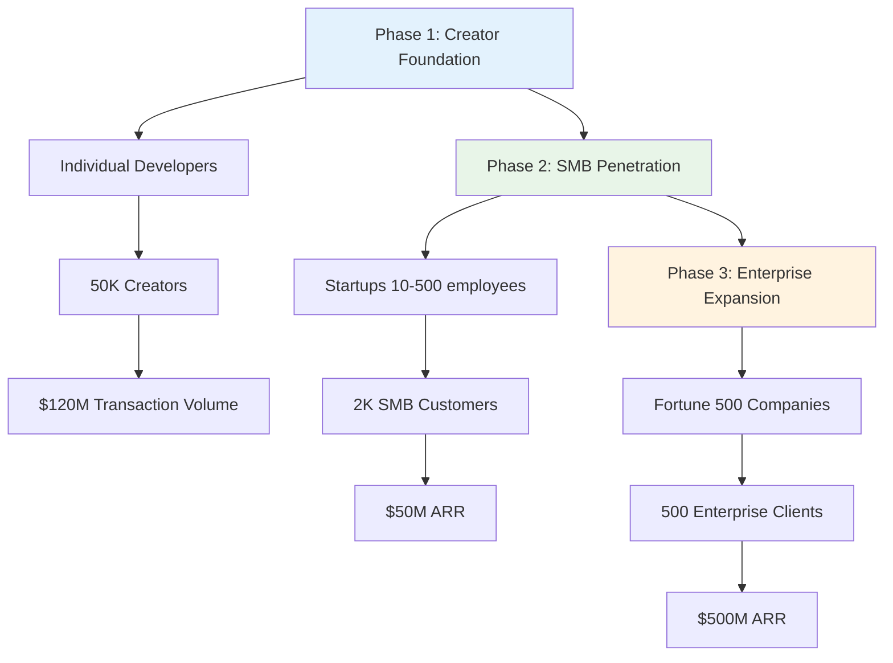
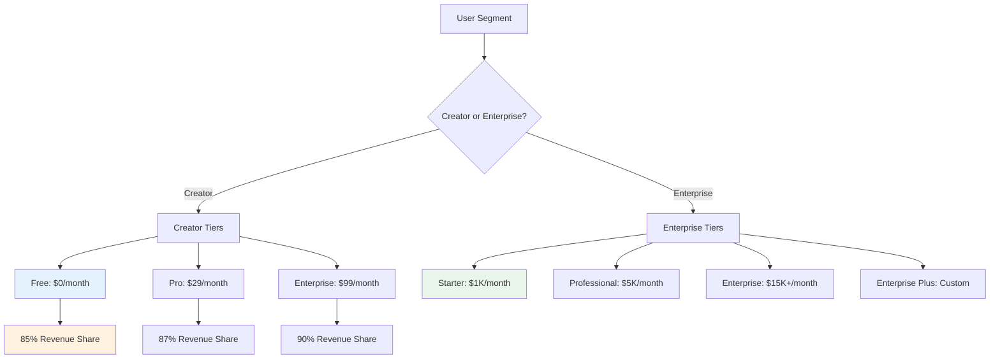

# AI Nomads Go-to-Market Strategy

## Executive Summary

AI Nomads will capture market share through a dual-track approach: democratizing AI agent creation for individual creators while providing enterprise-grade automation solutions. Our blockchain-powered marketplace creates network effects that compound competitive advantages.

## Market Entry Strategy

### Go-to-Market Phase Diagram



### Customer Acquisition Funnel

```mermaid
funnel
    title Creator Acquisition Journey
    "Market Awareness" 1000000
    "Technical Interest" 100000
    "Platform Trial" 50000
    "First Agent Creation" 25000
    "Revenue Generation" 15000
    "Active Creator" 10000
```

### Phase 1: Creator Economy Foundation (Months 1-12)

**Target Segment**: Individual developers, freelancers, and AI enthusiasts
**Primary Objective**: Establish creator ecosystem and prove unit economics

**Go-to-Market Tactics**:
- Developer conference sponsorships (200+ events annually)
- Technical content marketing (tutorials, case studies, documentation)
- Creator referral programs with revenue sharing incentives
- Partnership with coding bootcamps and online education platforms
- Open source contributions to build technical credibility

**Success Metrics**:
- 50,000 active creators by month 12
- Average creator revenue: $2,000/month
- Creator retention rate: >85%
- Platform transaction volume: $120M annually

### Phase 2: SMB Enterprise Penetration (Months 6-18)

**Target Segment**: Startups and growing companies (10-500 employees)
**Primary Objective**: Prove enterprise value proposition and refine product-market fit

**Go-to-Market Tactics**:
- Self-service enterprise trial programs
- Integration partnerships with popular business tools (Slack, Notion, Airtable)
- Customer success stories and case study development
- Webinar series focused on productivity automation
- Industry-specific agent template libraries

**Success Metrics**:
- 2,000 SMB customers by month 18
- Average contract value: $25,000 annually
- Net revenue retention: >120%
- Time to value: <14 days

### Phase 3: Fortune 500 Expansion (Months 12-36)

**Target Segment**: Large enterprises with dedicated IT teams
**Primary Objective**: Establish market leadership and drive platform adoption

**Go-to-Market Tactics**:
- Direct enterprise sales team (50+ reps by month 24)
- C-suite executive engagement programs
- Compliance certifications (SOC 2, ISO 27001, FedRAMP)
- White-label and private cloud deployment options
- Strategic partnership with system integrators

**Success Metrics**:
- 500 enterprise customers by month 36
- Average contract value: $250,000 annually
- 95% customer satisfaction scores
- 70% of Fortune 500 engaged or using platform

## Customer Acquisition Strategy

### Creator Acquisition

**Digital Marketing Channels**:
- Technical blog content (SEO-optimized, 5 posts weekly)
- YouTube tutorials and live coding sessions
- Developer community engagement (Reddit, Discord, GitHub)
- Paid advertising on technical platforms (Stack Overflow, GitHub)
- Conference speaking engagements and workshop facilitation

**Partnership Channels**:
- Integration partnerships with AI model providers (OpenAI, Anthropic, Cohere)
- Collaboration with freelancing platforms (Upwork, Fiverr)
- Educational institution partnerships for student developer programs
- Open source project sponsorships and contributions

**Creator Acquisition Funnel**:
1. **Awareness**: Technical content, conference presence, word-of-mouth
2. **Interest**: Free tier access, tutorial completion, community engagement
3. **Consideration**: Agent building tools, sandbox environment, peer examples
4. **Conversion**: First agent deployment, initial revenue generation
5. **Retention**: Ongoing revenue growth, community participation, platform advocacy

### Enterprise Acquisition

**Outbound Sales Strategy**:
- Account-based marketing for Fortune 1000 targets
- Executive relationship building through industry events
- Thought leadership content targeting decision makers
- Pilot program proposals with clear ROI demonstrations
- Reference customer development for social proof

**Inbound Marketing Strategy**:
- Executive-focused content (whitepapers, research reports, webinars)
- Search engine optimization for enterprise automation keywords
- Industry publication thought leadership
- Analyst relations and research report participation
- Customer success story amplification

**Enterprise Sales Process**:
1. **Prospecting**: Research and qualify high-value targets
2. **Discovery**: Understand automation needs and current pain points
3. **Demonstration**: Customized product demos showing relevant use cases
4. **Pilot**: Limited deployment to prove value and ROI
5. **Negotiation**: Contract terms, implementation timeline, success metrics
6. **Onboarding**: Dedicated customer success and technical implementation
7. **Expansion**: Additional use cases, departments, and agent deployments

## Pricing Strategy

### Pricing Architecture Flow



### Value-Based Pricing Model

```
💰 Creator Pricing Tiers

Free Tier        ████████████████████ 85% Revenue Share
Creator Pro      ████████████████████ 87% Revenue Share  
Creator Enterprise ██████████████████ 90% Revenue Share

🏢 Enterprise Pricing Scale

Starter          ████████             $1K/month (50 agents)
Professional     ████████████████     $5K/month (500 agents)
Enterprise       ████████████████████ $15K+/month (unlimited)
Enterprise Plus  ████████████████████ Custom pricing
```

### Creator Pricing Model

**Free Tier**:
- Up to 5 agents
- Basic analytics
- Community support
- Standard revenue sharing (85% creator, 15% platform)

**Creator Pro ($29/month)**:
- Unlimited agents
- Advanced analytics
- Priority support
- Enhanced revenue sharing (87% creator, 13% platform)
- Beta feature access

**Creator Enterprise ($99/month)**:
- White-label capabilities
- Custom branding
- Dedicated support
- API access
- Advanced revenue sharing (90% creator, 10% platform)

### Enterprise Pricing Model

**Starter ($1,000/month)**:
- Up to 50 agents
- Basic fleet management
- Standard integrations
- Email support
- Basic analytics

**Professional ($5,000/month)**:
- Up to 500 agents
- Advanced fleet management
- Premium integrations
- Dedicated support
- Advanced analytics and reporting

**Enterprise ($15,000+/month)**:
- Unlimited agents
- Custom fleet architectures
- White-label deployment
- 24/7 dedicated support
- Custom integrations and SLAs

**Enterprise Plus (Custom)**:
- Private cloud deployment
- Custom compliance requirements
- Dedicated customer success manager
- Strategic partnership terms
- Volume discounting

## Channel Strategy

### Direct Sales Channel

**Inside Sales Team**:
- SMB segment focus
- High-velocity sales process
- Digital demonstration capabilities
- CRM-driven pipeline management

**Enterprise Sales Team**:
- Field sales representatives
- Solution engineers
- Customer success managers
- Executive relationship managers

### Partner Channel Strategy

**System Integrator Partnerships**:
- Accenture, Deloitte, IBM for enterprise implementations
- Certified partner training programs
- Joint go-to-market initiatives
- Revenue sharing arrangements

**Technology Partnerships**:
- Cloud provider marketplaces (AWS, Azure, GCP)
- Integration partnerships with business software
- AI model provider collaborations
- Blockchain infrastructure partnerships

**Reseller Programs**:
- Regional reseller partnerships for international expansion
- Vertical industry specialists
- Managed service provider channels
- Value-added reseller (VAR) programs

## Competitive Positioning

### Against Process Automation (Zapier, Microsoft Power Platform)

**Key Differentiation**:
- Native AI capabilities vs. simple workflow automation
- Creator economy monetization vs. corporate-only focus
- Blockchain transparency vs. proprietary black boxes
- Rapid deployment vs. complex implementation

**Messaging Strategy**:
"While legacy automation requires IT teams and months of implementation, AI Nomads enables instant intelligent automation deployed by anyone, monetized transparently, and improved continuously through community innovation."

### Against RPA Solutions (UiPath, Blue Prism)

**Key Differentiation**:
- Democratic accessibility vs. enterprise-only complexity
- Intelligent agents vs. rule-based bots
- Marketplace economics vs. expensive consulting
- Self-improving systems vs. static automation

**Messaging Strategy**:
"Traditional RPA requires six-figure investments and months of consulting. AI Nomads delivers intelligent automation in minutes, improves automatically, and pays creators for innovation."

### Against Freelancing Platforms (Upwork, Fiverr)

**Key Differentiation**:
- 24/7 availability vs. human scheduling constraints
- Consistent quality vs. variable human performance
- Instant deployment vs. hiring timelines
- Scalable capacity vs. individual limitations

**Messaging Strategy**:
"Why wait weeks to hire freelancers when you can deploy proven AI agents instantly, scale infinitely, and achieve consistent results around the clock?"

## Success Metrics and KPIs

### Leading Indicators
- Website traffic and conversion rates
- Demo request volume and conversion
- Trial signup and activation rates
- Sales pipeline velocity and conversion
- Customer engagement and usage metrics

### Lagging Indicators
- Monthly recurring revenue (MRR) growth
- Customer acquisition cost (CAC) by channel
- Customer lifetime value (LTV) by segment
- Net revenue retention rates
- Market share and competitive win rates

### Channel Performance Metrics
- **Direct Sales**: Pipeline value, conversion rates, deal size
- **Partner Channel**: Partner-sourced revenue, partner productivity
- **Digital Marketing**: Cost per acquisition, content engagement
- **Product-Led Growth**: Trial-to-paid conversion, usage expansion

## Risk Mitigation

### Market Entry Risks
- **Competitive Response**: Build strong network effects early
- **Technology Changes**: Maintain model-agnostic architecture
- **Regulatory Challenges**: Proactive compliance and legal engagement
- **Economic Downturn**: Focus on recession-resistant automation value

### Execution Risks
- **Sales Team Scaling**: Hire experienced enterprise reps
- **Product-Market Fit**: Continuous customer feedback integration
- **Operational Scaling**: Invest in infrastructure and processes
- **Brand Building**: Consistent messaging and thought leadership

## International Expansion Strategy

### Phase 1 Markets (Months 12-24)
- **United Kingdom**: English-speaking, strong fintech sector
- **Canada**: Regulatory similarity, enterprise software adoption
- **Australia**: Asia-Pacific entry point, advanced digital economy

### Phase 2 Markets (Months 24-36)
- **Germany**: European economic powerhouse, manufacturing automation
- **France**: Government digitization initiatives, enterprise software market
- **Netherlands**: Technology adoption leadership, startup ecosystem

### Phase 3 Markets (Months 36-48)
- **Japan**: Advanced technology adoption, automation culture
- **Singapore**: Asia-Pacific hub, financial services focus
- **Brazil**: Latin American market entry, growing tech sector

### Localization Requirements
- Multi-language platform support
- Local payment methods and currencies
- Regional compliance and data residency
- Local partnership and sales teams
- Cultural customization for enterprise clients

## Conclusion

Our go-to-market strategy leverages the unique positioning of AI Nomads at the intersection of creator economy and enterprise automation. By building strong creator network effects first, we establish a sustainable competitive moat while developing enterprise-ready capabilities for long-term market dominance.

The phased approach ensures sustainable growth, manageable risk, and clear success milestones while building toward global platform leadership in the AI agent economy.