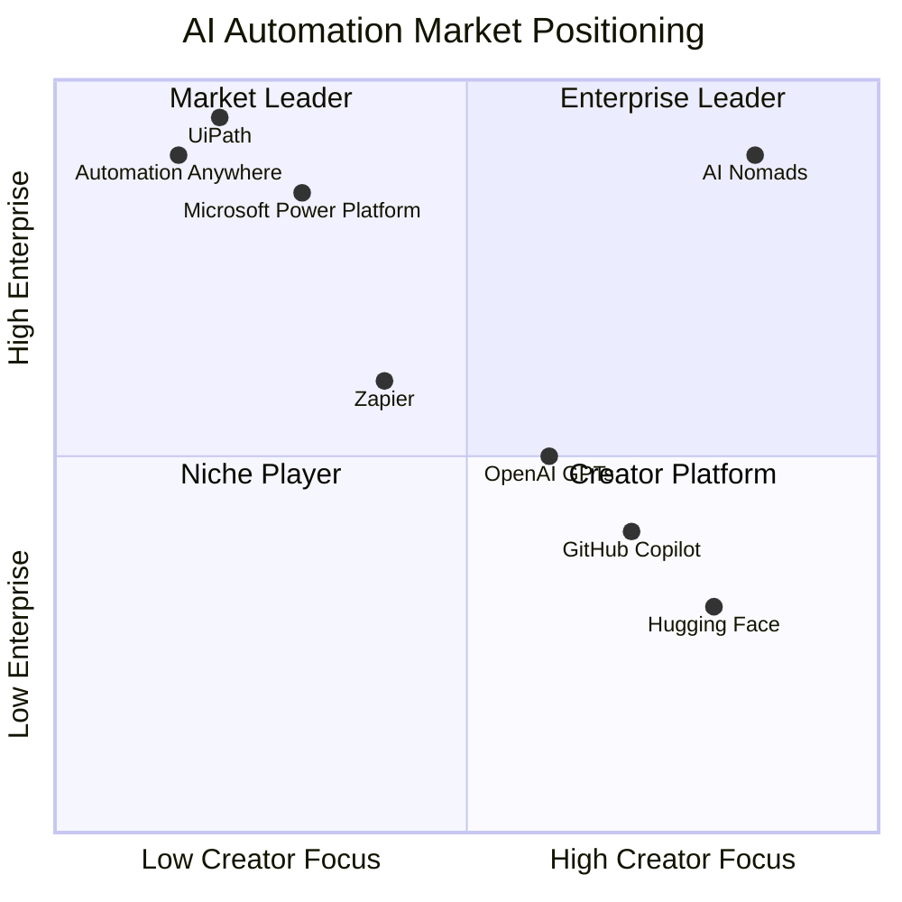
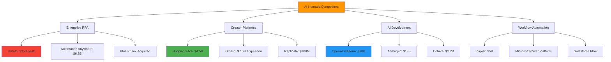
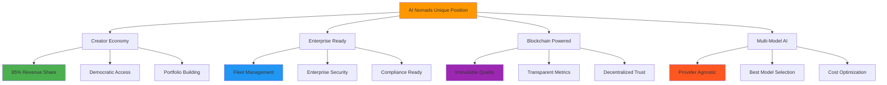
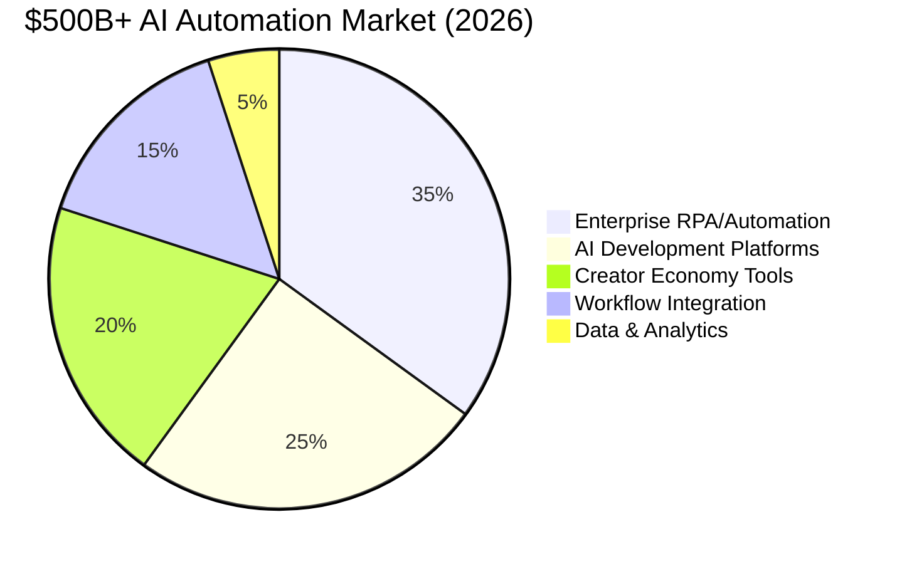
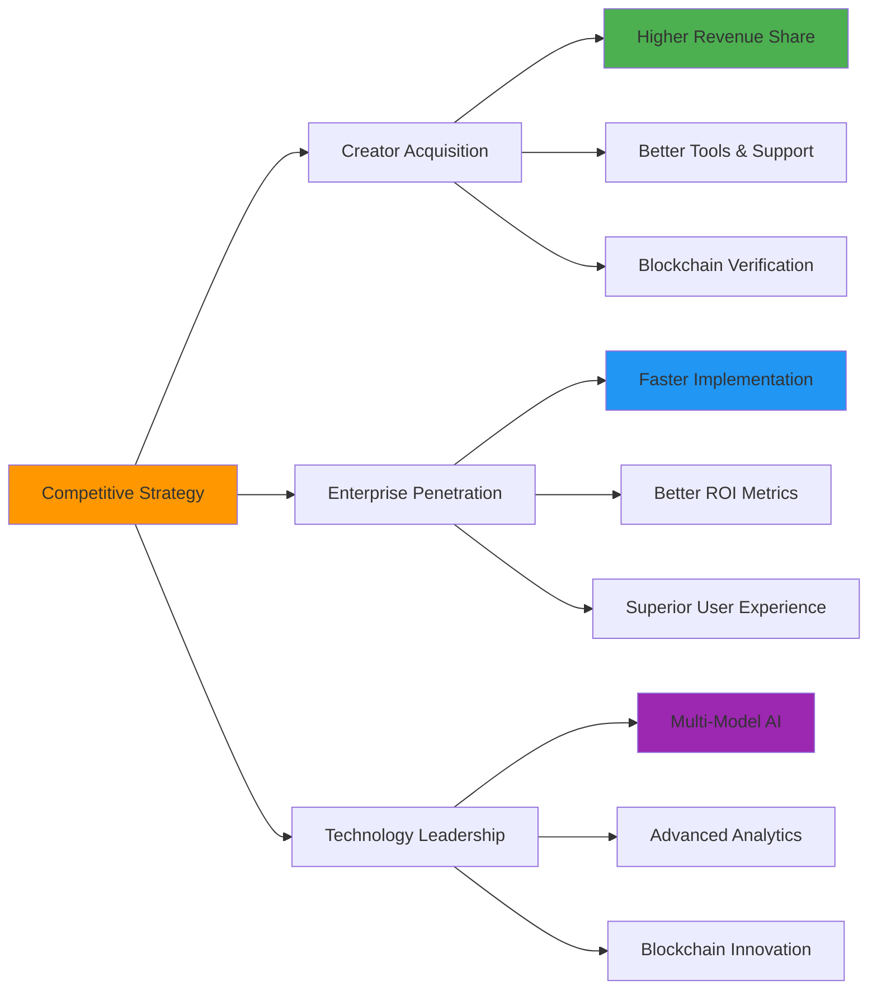
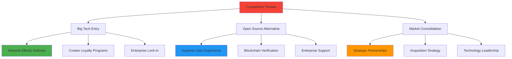

# AI Nomads Competitive Analysis & Market Positioning

## Executive Summary

AI Nomads occupies a unique position at the intersection of creator economy platforms, enterprise automation, and blockchain infrastructure. Our competitive moat combines network effects, creator lock-in, and blockchain immutability to create sustainable advantages against both incumbents and emerging competitors.

## Competitive Landscape Overview

### Market Positioning Matrix



### Competitive Categories



## Direct Competitor Analysis

### Enterprise RPA Leaders

**UiPath** (Public, $7B market cap)
- **Strengths**: Market leader, enterprise relationships, comprehensive platform
- **Weaknesses**: Complex setup, expensive, no creator economy, traditional RPA focus
- **Market Share**: 25% of RPA market
- **Our Advantage**: Creator-driven innovation, modern AI agents vs legacy bots

**Automation Anywhere** (Private, $6.8B valuation)
- **Strengths**: Cloud-native, good enterprise features, bot marketplace
- **Weaknesses**: Limited AI capabilities, no individual creator focus, high cost
- **Market Share**: 15% of RPA market
- **Our Advantage**: Blockchain monetization, democratic access, superior AI integration

**Microsoft Power Platform** (Part of $3T company)
- **Strengths**: Office integration, enterprise reach, low-code approach
- **Weaknesses**: Microsoft ecosystem lock-in, limited marketplace, corporate-only
- **Market Share**: 20% of workflow automation
- **Our Advantage**: Cross-platform agents, creator economy, blockchain verification

### AI Platform Competitors

**OpenAI GPT Store** (Private, $90B valuation)
- **Strengths**: Best-in-class models, massive user base, developer ecosystem
- **Weaknesses**: Centralized control, limited monetization, no enterprise focus
- **Market Share**: 60% of AI developer mindshare
- **Our Advantage**: Multi-model approach, enterprise deployment, creator revenue sharing

**Hugging Face** (Private, $4.5B valuation)
- **Strengths**: Open source community, model hub, developer tools
- **Weaknesses**: No enterprise deployment, limited monetization, technical complexity
- **Market Share**: 40% of ML model sharing
- **Our Advantage**: Enterprise-ready deployment, blockchain monetization, visual interface

**Anthropic Claude** (Private, $18B valuation)
- **Strengths**: Safety focus, high-quality models, enterprise features
- **Weaknesses**: API-only, no marketplace, limited customization
- **Market Share**: 15% of enterprise AI market
- **Our Advantage**: Agent marketplace, creator ecosystem, deployment automation

### Creator Economy Platforms

**GitHub Copilot** ($7.5B acquisition by Microsoft)
- **Strengths**: Developer integration, code generation, massive user base
- **Weaknesses**: Code-only focus, no agent deployment, limited enterprise features
- **Market Share**: 70% of AI coding assistants
- **Our Advantage**: Beyond coding, agent deployment, revenue sharing for creators

**Zapier** (Private, $5B valuation)
- **Strengths**: Simple integrations, large app ecosystem, SMB focus
- **Weaknesses**: Limited AI capabilities, no creator economy, basic automation
- **Market Share**: 45% of workflow automation for SMBs
- **Our Advantage**: AI-powered agents, creator monetization, enterprise deployment

## Competitive Advantages Analysis

### Unique Value Proposition Matrix



### Competitive Moats

**Network Effects** (Strongest Defense):
- Creator agents improve with usage data
- Enterprise deployments generate training signals
- Community contributions compound platform value
- Blockchain verification creates trust network

**Creator Lock-in** (Revenue Dependency):
- Average creator earns $2,800/month on platform
- Portfolio building requires continued engagement
- Revenue sharing creates financial incentive to stay
- Brand building happens within AI Nomads ecosystem

**Data Network Effects** (Blockchain Immutability):
- Agent performance data stored on blockchain
- Quality metrics publicly verifiable
- Historical performance creates competitive advantages
- Switching costs increase over time

**Technical Moats** (Platform Sophistication):
- Multi-model AI orchestration
- Enterprise-grade fleet management
- Automated deployment and scaling
- Integrated blockchain infrastructure

## Market Share Analysis

### Total Addressable Market Breakdown



### AI Nomads Market Capture Strategy

```
🎯 Market Share Progression (5-Year Plan)

2025: Market entry and validation
██ 0.1% market share ($500M addressable)

2026: Creator economy leadership
████ 0.5% market share ($2.5B addressable)

2027: Enterprise expansion
████████ 1.0% market share ($5B addressable)

2028: Multi-market dominance
████████████ 2.0% market share ($10B addressable)

2029: Global platform leadership
████████████████ 3.0% market share ($15B addressable)
```

### Competitive Response Analysis

**Expected Competitive Reactions**:

1. **UiPath/Automation Anywhere**: Likely to add marketplace features but constrained by legacy architecture and enterprise-only focus

2. **OpenAI/Anthropic**: May enhance creator monetization but limited by centralized model approach and lack of enterprise deployment features

3. **Microsoft**: Could integrate marketplace into Power Platform but constrained by ecosystem lock-in strategy

4. **New Entrants**: Venture-backed startups may copy model but lack our early mover advantage and blockchain infrastructure

## Competitive Positioning Strategy

### Differentiation Framework

**Against Enterprise RPA** (UiPath, Automation Anywhere):
- "Modern AI agents vs legacy bots"
- "Creator-driven innovation vs corporate IT"
- "Blockchain verification vs proprietary black boxes"
- "Democratic access vs enterprise-only"

**Against AI Platforms** (OpenAI, Hugging Face):
- "Enterprise deployment vs API-only"
- "Creator revenue sharing vs platform control"
- "Multi-model approach vs single provider lock-in"
- "Visual fleet management vs technical complexity"

**Against Creator Platforms** (GitHub, Zapier):
- "AI agents vs simple automation"
- "Enterprise-grade vs SMB-focused"
- "Blockchain monetization vs traditional revenue sharing"
- "Cross-industry vs developer-only"

### Go-to-Market Competitive Strategy



## Competitive Intelligence

### Key Metrics Comparison

```
📊 Platform Comparison (2025 Estimates)

Creator Revenue Share:
AI Nomads:     ███████████████████████ 85-90%
Hugging Face:  ████████████████ 70%
GitHub:        ████████ 40%
OpenAI GPTs:   ██████ 30%

Enterprise Features:
AI Nomads:     ████████████████████████ 95%
UiPath:        ██████████████████████ 90%
Power Platform: ████████████████████ 80%
Zapier:        ████████████ 60%

AI Capabilities:
AI Nomads:     ████████████████████████ 95%
OpenAI:        ██████████████████████ 90%
Anthropic:     ████████████████████ 80%
UiPath:        ████████ 40%
```

### Competitive Weaknesses to Exploit

**Enterprise RPA Incumbents**:
- Legacy architecture limiting AI integration
- High implementation costs and complexity
- Lack of creator economy and innovation
- Vendor lock-in concerns

**AI Platform Leaders**:
- Limited enterprise deployment capabilities
- No creator monetization at scale
- Single-model dependency risks
- Lack of workflow automation features

**Workflow Automation Tools**:
- Limited AI capabilities
- No creator economy
- SMB focus limits enterprise growth
- Simple automation vs intelligent agents

## Risk Mitigation

### Competitive Threat Responses



Our competitive analysis reveals AI Nomads' unique positioning enables sustainable competitive advantages through creator economy network effects, blockchain verification, and enterprise-grade deployment capabilities that no current competitor can replicate without fundamental platform rebuilds.