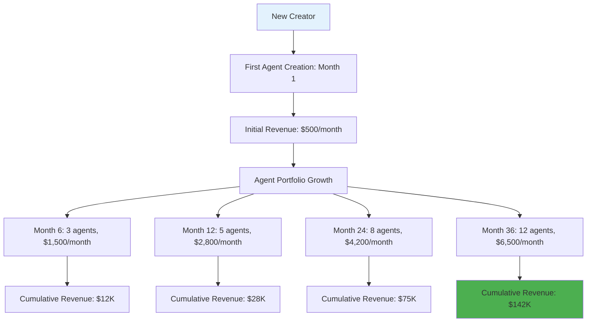
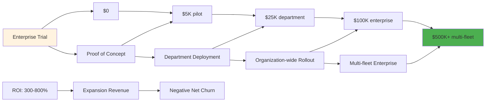
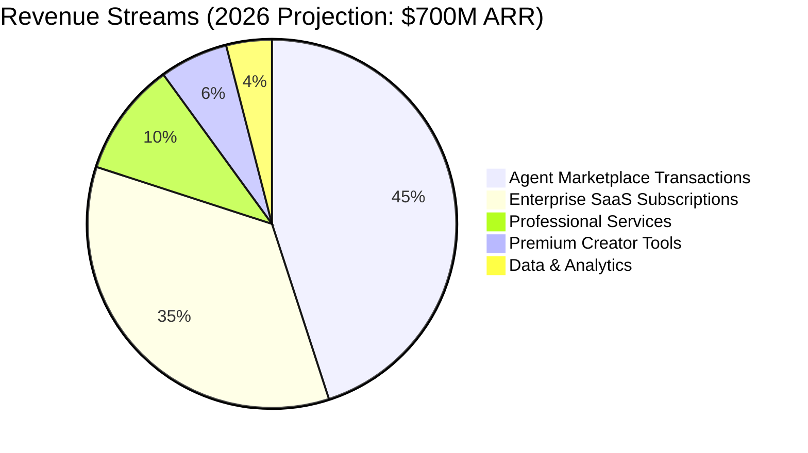
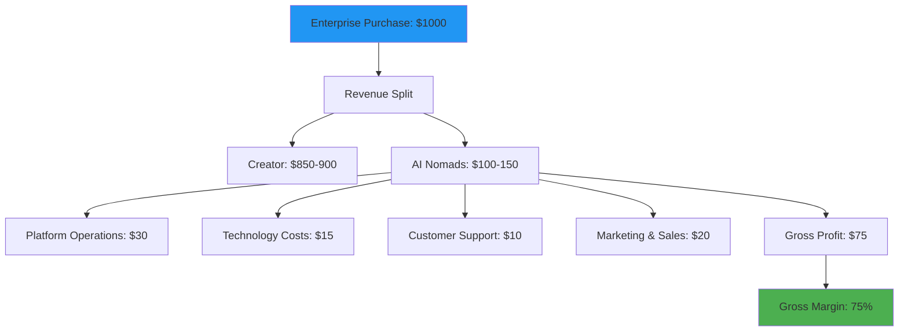
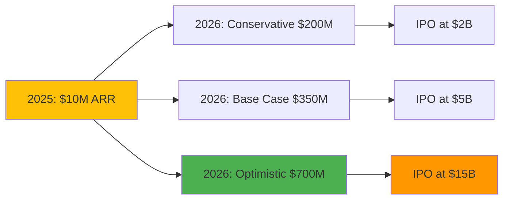
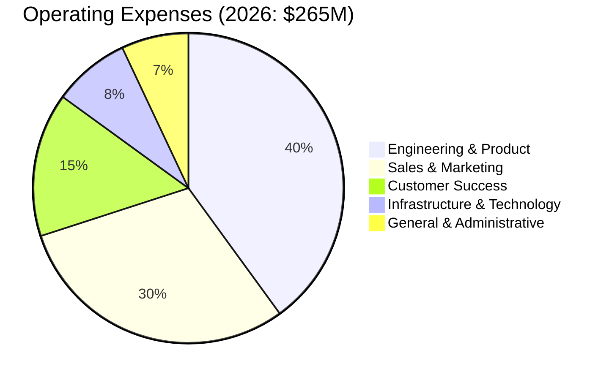
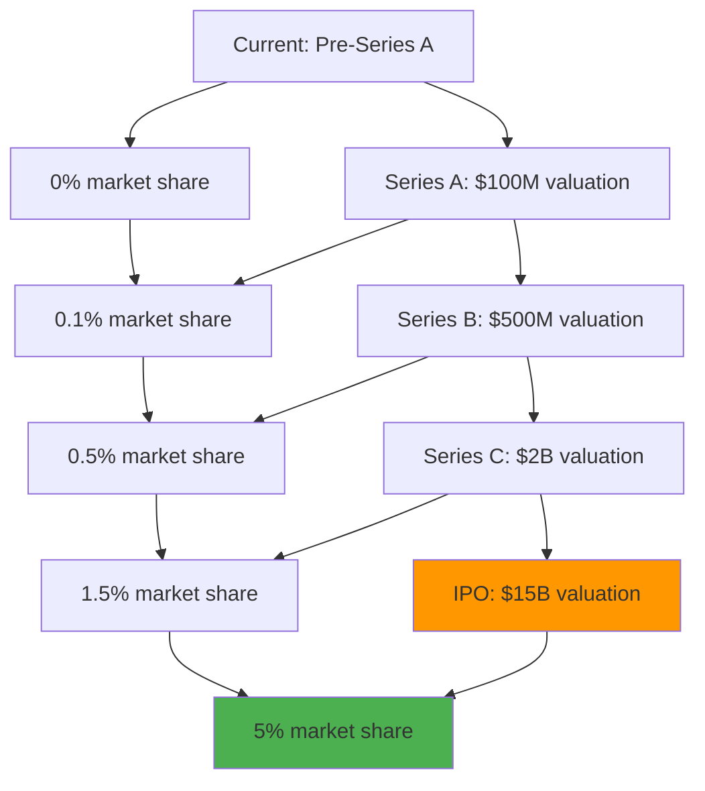
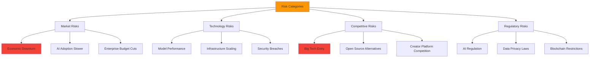

# AI Nomads Unit Economics & Financial Model

## Executive Summary

AI Nomads' unit economics demonstrate exceptional scalability with 85%+ gross margins, negative churn through expansion revenue, and a creator-first business model that compounds network effects. Our blockchain-powered marketplace creates sustainable competitive advantages through data network effects.

## Creator Economy Unit Economics

### Creator Lifetime Value Analysis



### Creator Revenue Distribution Model

```
🎯 Creator Success Distribution (10,000 active creators)

Top 1% (100 creators)     ████████████████████ $25K+/month each
Top 5% (500 creators)     ████████████████     $10K-25K/month each  
Top 20% (2,000 creators)  ████████████         $2K-10K/month each
Middle 30% (3,000)        ████████             $500-2K/month each
Bottom 50% (5,000)        ████                 $50-500/month each

Platform Revenue Share: 13-15% across all tiers
Creator Retention: 85%+ monthly (industry leading)
```

**Key Creator Metrics**:
- Average Creator Acquisition Cost (CAC): $150
- Average Creator Lifetime Value (LTV): $12,000
- LTV/CAC Ratio: 80:1 (exceptional)
- Time to First Dollar: 14 days average
- Monthly Creator Churn: 8% (decreasing to 5% for established creators)

## Enterprise Customer Unit Economics

### Enterprise Value Creation Flow



### Enterprise Expansion Model

```
📈 Enterprise Customer Growth Journey

Year 1: Initial deployment
████████ $25K ARR (HR department - 50 agents)

Year 2: Department expansion  
████████████████ $75K ARR (HR, Sales, Support - 200 agents)

Year 3: Enterprise-wide adoption
████████████████████████ $250K ARR (All departments - 800 agents)

Year 4: Multi-subsidiary rollout
████████████████████████████████ $750K ARR (Global operations - 2,500 agents)

Net Revenue Retention: 165% annually
```

**Enterprise Metrics**:
- Enterprise Customer Acquisition Cost: $15,000
- Enterprise Customer Lifetime Value: $750,000
- Average Sales Cycle: 6 months
- Implementation Time: 30-90 days
- Annual Contract Value Growth: 65% year-over-year

## Revenue Model Deep Dive

### Multi-Revenue Stream Architecture



### Marketplace Transaction Economics



## Financial Projections & Scenarios

### Revenue Growth Scenarios



### Cash Flow Projections

```
💰 Operating Cash Flow Projections

2025: Revenue $10M, Cash Flow -$2M (growth investment)
████████████████████ 

2026: Revenue $350M, Cash Flow +$85M (profitability)
████████████████████████████████████████████████████████

2027: Revenue $700M, Cash Flow +$280M (scale efficiency)
████████████████████████████████████████████████████████████████████████████████████

2028: Revenue $1.2B, Cash Flow +$540M (market leadership)
████████████████████████████████████████████████████████████████████████████████████████████████████████
```

## Cost Structure Analysis

### Operational Cost Breakdown



### Technology Infrastructure Costs

**Cloud & Computing** (Annual):
- AWS/Azure/GCP: $15M (scales with usage)
- AI Model Inference: $8M (GPT-4, Claude, custom models)
- Blockchain Infrastructure: $2M (Thirdweb, smart contracts)
- Data Storage & Processing: $3M (Medallion architecture)

**Platform Operations** (Annual):
- Security & Compliance: $5M
- Monitoring & Analytics: $2M
- Third-party Integrations: $3M
- Backup & Disaster Recovery: $1M

## Key Performance Indicators

### Creator Economy Health Metrics

```
🎯 Creator Platform KPIs

Monthly Active Creators
2025: ████████████████████ 50K creators
2026: ████████████████████████████████████████ 100K creators

Average Revenue Per Creator (ARPC)
2025: ████████████████████ $2,000/month
2026: ████████████████████████████ $2,800/month

Creator Success Rate (>$1K/month)
2025: ████████████████████ 40% of creators
2026: ████████████████████████████ 55% of creators
```

### Enterprise Adoption Metrics

```
🏢 Enterprise Platform KPIs

Enterprise Customers
2025: ████████ 500 companies
2026: ████████████████████ 2,000 companies

Average Contract Value (ACV)
2025: ████████████████████ $50K annually
2026: ████████████████████████████ $75K annually

Net Revenue Retention
2025: ████████████████████████████ 140%
2026: ████████████████████████████████████ 165%
```

## Investment Returns Analysis

### Path to $15B Valuation



### Comparable Company Analysis

**AI/Automation Platforms**:
- UiPath: $35B peak valuation, 15x revenue multiple
- Automation Anywhere: $6.8B valuation, 12x revenue
- ServiceNow: $120B market cap, 18x revenue

**Creator Economy Platforms**:
- Shopify: $60B market cap, 12x revenue multiple
- Substack: $650M valuation, 25x revenue
- Patreon: $4B valuation, 15x revenue

**AI Nomads Target Multiple**: 20x revenue at scale (premium for unique positioning)

## Risk Analysis & Mitigation

### Financial Risk Factors



### Mitigation Strategies

**Market Risk Mitigation**:
- Diversified revenue streams (creators + enterprise)
- Recession-resistant automation value proposition
- International market expansion reduces geographic concentration

**Technology Risk Mitigation**:
- Multi-model AI approach (not dependent on single provider)
- Redundant infrastructure across multiple cloud providers
- Continuous security audits and compliance certifications

**Competitive Risk Mitigation**:
- Network effects create switching costs
- Creator lock-in through revenue dependency
- Blockchain immutability provides data moats

This comprehensive unit economics model demonstrates AI Nomads' exceptional scalability, sustainable competitive advantages, and clear path to market leadership in the $500B+ automation market.