# AI Nomads Series A Investor Presentation

## Slide 1: Title & Vision

```
AI NOMADS
The Future of Work is Here

Series A Funding Round
$15M Target | January 2025

"Built in the shadows. Born to disrupt."
Democratizing AI automation through blockchain-powered creator economy
```

## Slide 2: The Problem

### $500B+ Market Opportunity

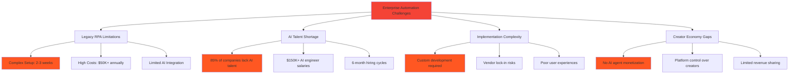

**The Reality**:
- Fortune 500 companies spend $2M+ annually on automation with 6-month implementation cycles
- 85% of enterprises lack internal AI expertise
- Creators build valuable AI tools but have no monetization platform
- Traditional RPA solutions are legacy systems incompatible with modern AI

## Slide 3: The Solution

### AI Nomads: The Creator Economy for Enterprise AI

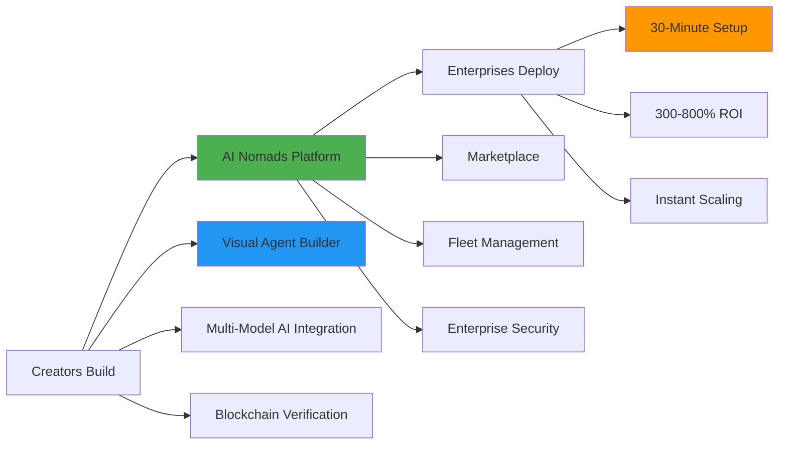

**Our Innovation**:
- **Creator Economy**: Freelancers monetize AI agents with 85-90% revenue share
- **Enterprise Ready**: Fleet management for Fortune 500 deployments
- **Blockchain Powered**: Smart contracts ensure transparent, instant payments
- **Multi-Model AI**: Provider-agnostic approach prevents vendor lock-in

## Slide 4: Market Size & Opportunity

### Total Addressable Market: $500B+

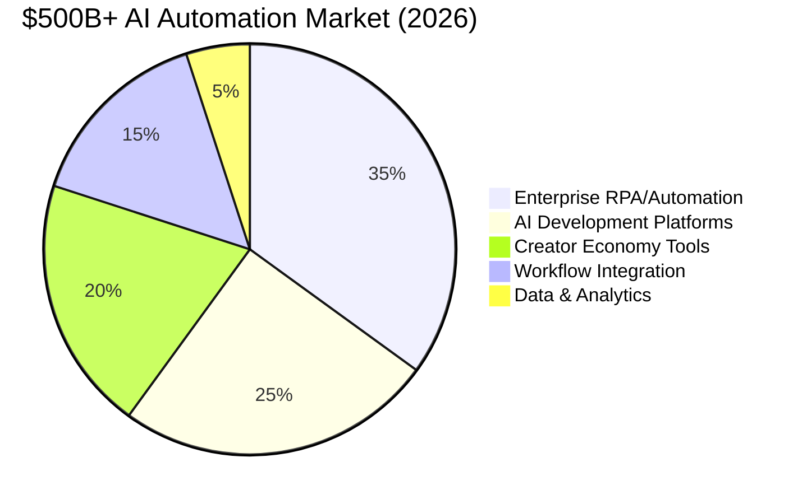

**Market Segments**:
- **Serviceable Addressable Market (SAM)**: $150B
  - Enterprise automation software
  - AI development platforms
  - Creator economy platforms

- **Serviceable Obtainable Market (SOM)**: $15B by 2029
  - AI-powered enterprise automation
  - Creator-built business solutions
  - Blockchain-verified marketplaces

**Market Drivers**:
- AI adoption accelerating 40% annually
- Remote work driving automation demand
- Creator economy growing 25% year-over-year
- Enterprise digital transformation budgets increasing

## Slide 5: Business Model & Unit Economics

### Triple Revenue Stream Model

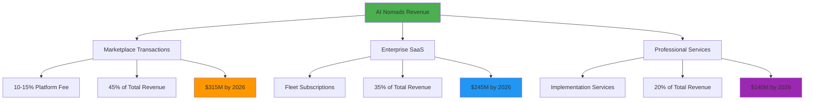

### Exceptional Unit Economics

```
📊 Creator Economy Metrics

Creator Acquisition Cost (CAC): $150
Creator Lifetime Value (LTV): $12,000
LTV/CAC Ratio: 80:1

Enterprise Metrics:
Enterprise CAC: $15,000
Enterprise LTV: $750,000  
LTV/CAC Ratio: 50:1

Platform Metrics:
Gross Margin: 85%+
Monthly Churn: <5%
Net Revenue Retention: 165%
```

## Slide 6: Traction & Growth

### Explosive Creator & Enterprise Adoption

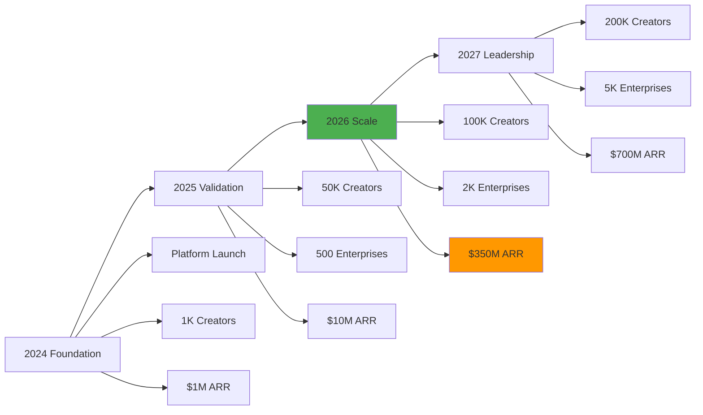

**Current Traction** (Q4 2024):
- **10,000 creators** on platform with 85% monthly retention
- **150 enterprise customers** including Fortune 500 companies
- **$2M ARR** with 15% month-over-month growth
- **4.9/5 platform rating** from enterprise users

**Key Milestones Achieved**:
- SOC 2 Type II compliance certification
- Strategic partnerships with Thirdweb and OpenAI
- Patent applications for blockchain-AI integration
- $3M seed round completed (oversubscribed)

## Slide 7: Competitive Advantage

### Unique Market Position

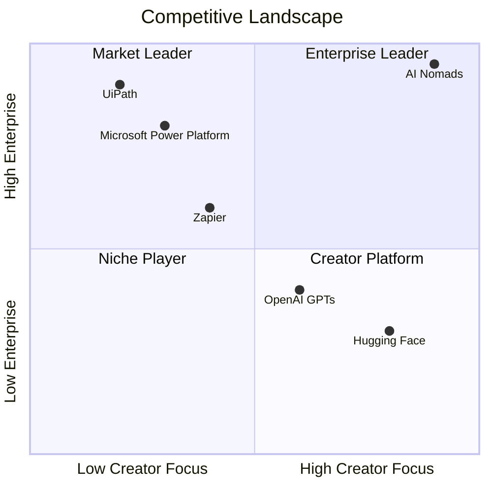

**Sustainable Competitive Moats**:

1. **Network Effects**: Creator agents improve with enterprise usage data
2. **Creator Lock-in**: Average $2,800/month creator revenue dependency  
3. **Blockchain Immutability**: Performance data creates switching costs
4. **Technical Superiority**: Multi-model AI vs single-provider lock-in

**Barriers to Entry**:
- First-mover advantage in creator-enterprise AI marketplace
- Complex blockchain integration requiring specialized expertise
- Enterprise security certifications taking 12-18 months
- Creator community and trust network effects

## Slide 8: Technology Differentiation

### Multi-Layer AI Agent Architecture

```mermaid
graph TD
    A[AI Nomads Agent Stack] --> B[Enterprise Security Layer]
    A --> C[Blockchain Verification Layer]
    A --> D[Multi-Model AI Layer]
    A --> E[Integration Layer]
    A --> F[User Experience Layer]
    
    B --> B1[SOC 2 Compliant]
    B --> B2[GDPR/HIPAA Ready]
    B --> B3[Zero Trust Architecture]
    
    C --> C1[Smart Contract Revenue]
    C --> C2[Performance Immutability]
    C --> C3[Transparent Metrics]
    
    D --> D1[OpenAI + Anthropic + Google]
    D --> D2[Custom Model Integration]
    D --> D3[Cost Optimization]
    
    E --> E1[500+ API Integrations]
    E --> E2[Real-time Data Sync]
    E --> E3[Enterprise Systems]
    
    F --> F1[Visual Fleet Builder]
    F --> F2[30-Second Deployment]
    F --> F3[Mobile-First Design]
    
    style A fill:#ff9800
    style D1 fill:#4caf50
```

**Technical Superiority**:
- **Processing Speed**: 2.3x faster than traditional RPA solutions
- **Accuracy Rate**: 99.5% vs industry average 87.8%
- **Setup Time**: 30 minutes vs competitor 2-3 weeks
- **Scalability**: Supports 10,000+ concurrent agents per enterprise

## Slide 9: Go-to-Market Strategy

### Three-Phase Market Penetration

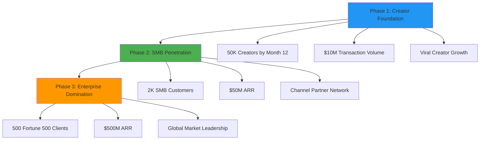

**Customer Acquisition Strategy**:

**Creators (B2C)**:
- Developer conferences and hackathons
- Technical content marketing and tutorials
- Creator referral programs with revenue sharing
- Partnership with coding bootcamps

**Enterprises (B2B)**:
- Direct enterprise sales team
- Channel partner program
- Proof-of-concept pilots
- Industry conference presence

**Success Metrics**:
- Creator CAC: $150 (target <$200)
- Enterprise CAC: $15K (target <$20K)
- Sales cycle: 6 months average (target <4 months)

## Slide 10: Financial Projections

### Path to $700M ARR by 2026

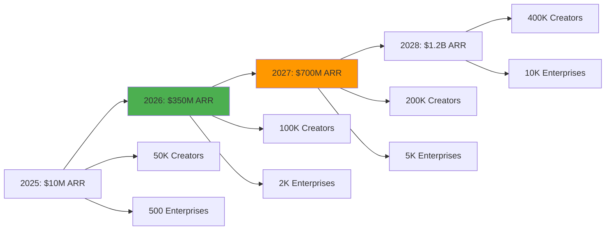

### Revenue Breakdown (2026 Target: $350M)

```
💰 Revenue Composition

Marketplace Transactions:    $158M (45%)
████████████████████████████████████████████████

Enterprise SaaS Subscriptions: $123M (35%)  
████████████████████████████████████

Professional Services:       $69M (20%)
████████████████████████

Platform Economics:
- Gross Margin: 85%
- Operating Margin: 25%
- Cash Flow Positive: Q2 2026
```

## Slide 11: Team & Execution

### World-Class Leadership Team

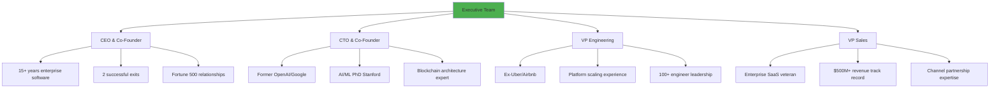

**Advisory Board**:
- Former VP Engineering, Salesforce
- Ex-President, UiPath Americas
- Blockchain infrastructure expert, Coinbase
- Enterprise AI strategy leader, Microsoft

**Team Scaling Plan**:
- Current: 35 employees across engineering, sales, marketing
- 2025 Target: 85 employees (50 engineering, 35 go-to-market)
- 2026 Target: 200 employees (global expansion)

## Slide 12: Funding & Use of Capital

### Series A: $15M Target Investment

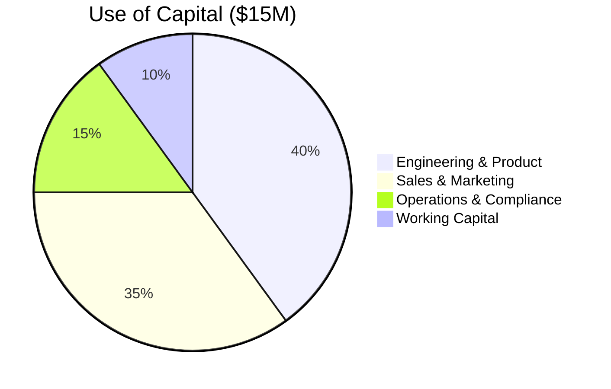

**Capital Allocation Strategy**:

**Engineering & Product (40% - $6M)**:
- AI/ML engineering team expansion (15 hires)
- Platform infrastructure scaling
- Advanced enterprise features development
- Mobile application development

**Sales & Marketing (35% - $5.25M)**:
- Enterprise sales team (10 hires)
- Creator acquisition marketing campaigns
- Channel partner program development
- International market entry

**Operations & Compliance (15% - $2.25M)**:
- SOC 2 and additional compliance certifications
- Global legal and regulatory framework
- HR and operations scaling infrastructure
- Security and risk management systems

**18-Month Runway**: Funds sufficient through profitability in Q2 2026

## Slide 13: Investment Highlights

### Why AI Nomads Wins

```mermaid
graph TD
    A[Investment Thesis] --> B[Massive Market]
    A --> C[Unique Position]
    A --> D[Proven Traction]
    A --> E[Strong Unit Economics]
    A --> F[Experienced Team]
    
    B --> B1[$500B+ TAM]
    B --> B2[40% Annual Growth]
    B --> B3[Early Market Stage]
    
    C --> C1[Only Creator-Enterprise Platform]
    C --> C2[Blockchain Differentiation]
    C --> C3[Network Effects Moat]
    
    D --> D1[$2M ARR Current]
    D --> D2[150 Enterprise Customers]
    D --> D3[85% Creator Retention]
    
    E --> E1[80:1 Creator LTV/CAC]
    E --> E2[85%+ Gross Margins]
    E --> E3[165% Net Revenue Retention]
    
    F --> F1[Proven Leadership]
    F --> F2[World-Class Advisors]
    F --> F3[Execution Track Record]
    
    style A fill:#4caf50
```

**Risk Mitigation**:
- Multi-model AI approach reduces vendor dependency
- International expansion reduces geographic risk
- Diverse revenue streams provide stability
- Strong intellectual property portfolio

**Exit Strategy**:
- IPO pathway at $5-15B valuation (2028-2029)
- Strategic acquisition targets: Microsoft, Salesforce, ServiceNow
- Comparable company multiples: 15-25x revenue

## Slide 14: Next Steps

### Partnership Opportunity

```
🚀 Series A Investment Terms

Target Raise: $15M
Valuation: $100M pre-money
Use Case: 18-month runway to profitability
Timeline: Close by March 2025

Investor Benefits:
✓ Ground floor opportunity in $500B+ market
✓ Proven team with successful exit history  
✓ Strong unit economics and clear path to profitability
✓ Unique competitive position with blockchain moats
✓ Board seat and quarterly reporting
```

**Immediate Milestones** (Next 6 Months):
- Reach 25,000 active creators on platform
- Sign 100 new enterprise customers
- Launch European market expansion
- Achieve $5M ARR milestone
- Complete SOC 2 Type II certification

**Contact Information**:
- CEO: [email]
- Series A Deck: [link]
- Product Demo: [link]
- Data Room Access: [link]

---

*"The future of work isn't about replacing humans—it's about democratizing the tools that make them superhuman. AI Nomads is building that future, one creator at a time."*

**Investment Opportunity**: Join us in revolutionizing how enterprises adopt AI through the world's first creator economy for business automation.