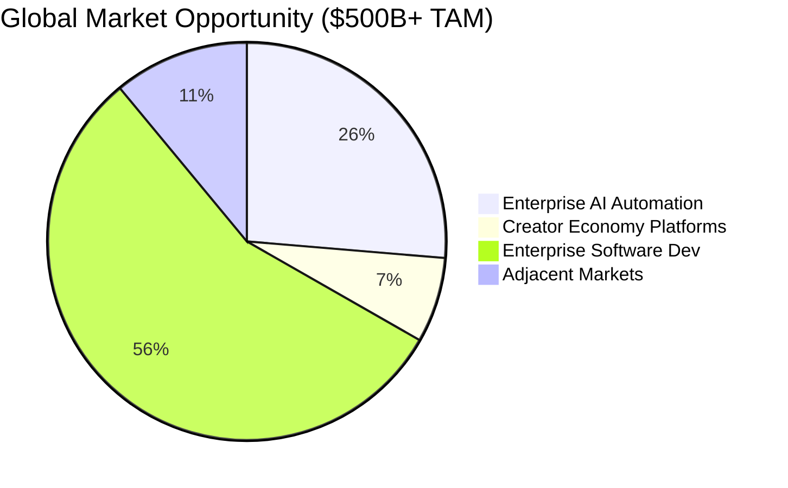
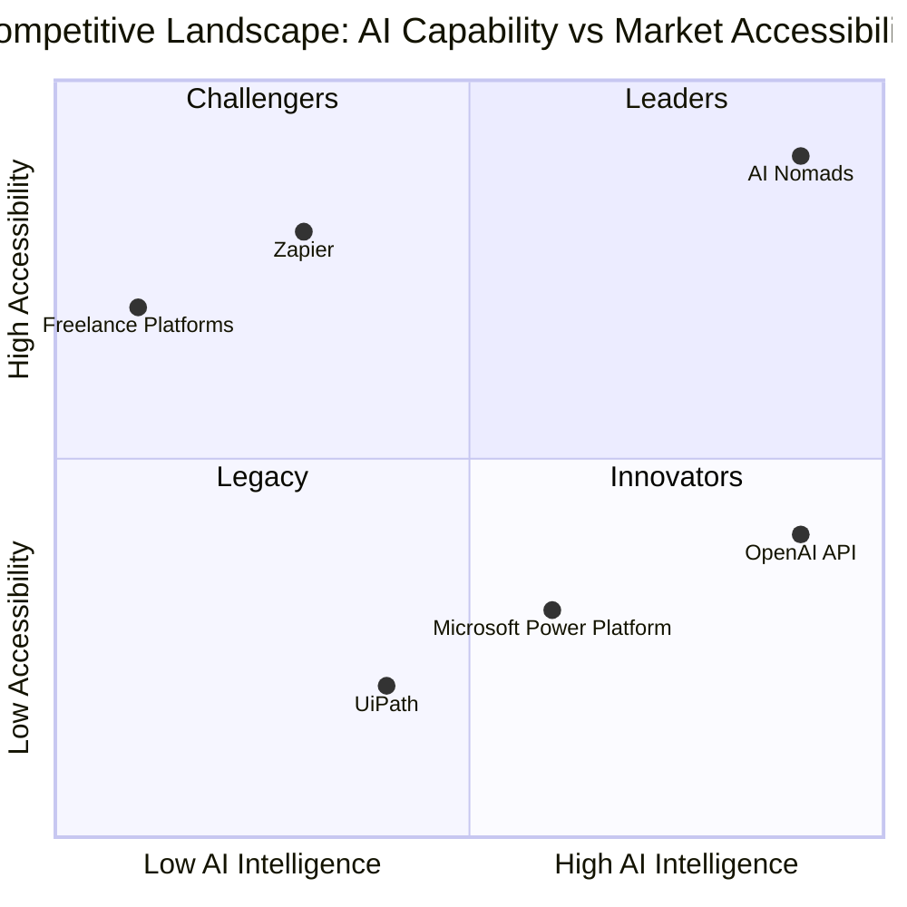

# AI Nomads Market Analysis

## Executive Summary

AI Nomads is positioned at the intersection of three rapidly expanding markets: AI automation ($394B by 2028), creator economy ($104B by 2025), and enterprise software ($835B by 2030). Our unique blockchain-enabled marketplace for AI agents addresses critical pain points in talent acquisition, workflow automation, and scalable productivity.

## Total Addressable Market (TAM)

### Market Size Visualization



### Market Growth Trajectory

```
📈 Market Evolution 2024-2030

Enterprise AI Automation
$150B ████████████████████████████████████████ $395B
2024                                        2028

Creator Economy
 $80B ████████████████████████████████████████ $104B
2024                                        2025

Enterprise Software
$650B ████████████████████████████████████████ $836B
2024                                        2030

AI Nomads Opportunity
  $0 ████████████████████████████████████████  $29B
2024                                        2030
```

### Primary Market Segments

**Enterprise AI Automation**
- Market Size: $394.9B by 2028 (CAGR: 37.2%)
- Key Drivers: Digital transformation, labor shortage, efficiency demands
- Our Share Potential: $15.7B (4% capture rate over 5 years)

**Creator Economy Platforms**
- Market Size: $104.2B by 2025 (CAGR: 22.3%)
- Key Drivers: Gig economy growth, remote work adoption, skill monetization
- Our Share Potential: $5.2B (5% capture rate focusing on AI creators)

**Enterprise Software Development**
- Market Size: $835.7B by 2030 (CAGR: 12.8%)
- Key Drivers: Cloud adoption, microservices, DevOps transformation
- Our Share Potential: $8.4B (1% capture rate in specialized agent development)

### Geographic Breakdown

**North America (45% of TAM)**
- Strong enterprise adoption
- Venture capital availability
- Regulatory framework maturity
- Early adopter mindset

**Europe (25% of TAM)**
- Data privacy leadership (GDPR compliance advantage)
- Strong fintech and enterprise software markets
- Government AI initiatives

**Asia-Pacific (25% of TAM)**
- Rapid digital transformation
- Large developer communities
- Manufacturing automation needs
- Mobile-first adoption patterns

**Rest of World (5% of TAM)**
- Emerging markets with leapfrog potential
- Cost-sensitive implementations
- Localization opportunities

## Competitive Landscape

### Competitive Positioning Matrix



### Market Share Distribution

```
🏆 Current Automation Market Leaders

Zapier (Workflow Automation)     ████████████████████ $5B (25%)
Microsoft Power Platform         ████████████████     $2.5B (12.5%)
UiPath (RPA)                     ████████████████████████ $14.8B (74%)
Salesforce Automation           ████████████         $1.8B (9%)
Other Players                    ████████             $1.2B (6%)

AI Nomads Target Position by 2028
Current Market Share: <0.1%
Target Market Share: 4-5% ($15-25B)
```

### Direct Competitors

**Zapier (Process Automation)**
- Strengths: Market leadership, 6M+ users, extensive integrations
- Weaknesses: Limited AI capabilities, no creator economy, workflow-only focus
- Market Cap: $5B (Private)
- Our Advantage: Native AI agents vs. simple workflow automation

**Microsoft Power Platform**
- Strengths: Enterprise relationships, Office 365 integration, comprehensive suite
- Weaknesses: Complex implementation, high costs, limited flexibility
- Revenue: $2.5B annually
- Our Advantage: Democratic access, blockchain monetization, specialized AI agents

**UiPath (RPA)**
- Strengths: RPA market leader, enterprise focus, proven ROI
- Weaknesses: Technical complexity, high implementation costs, limited AI
- Market Cap: $14.8B (Public)
- Our Advantage: No-code agent creation, creator economy incentives

### Revenue Model Analysis

**Platform Commission (Primary)**
- 15% commission on all agent transactions
- Projected: $250M by Year 5
- Gross Margin: 95%
- Defensibility: Network effects, switching costs

**Enterprise Subscriptions**
- Monthly/annual licensing for fleet management
- Projected: $150M by Year 5
- Gross Margin: 85%
- Defensibility: Sticky enterprise relationships

**Premium Features**
- Advanced analytics, white-labeling, priority support
- Projected: $75M by Year 5
- Gross Margin: 90%
- Defensibility: Product differentiation

### Unit Economics

**Creator Acquisition**
- Customer Acquisition Cost (CAC): $150
- Lifetime Value (LTV): $12,000
- LTV/CAC Ratio: 80:1
- Payback Period: 3 months

**Enterprise Acquisition**
- Customer Acquisition Cost (CAC): $15,000
- Lifetime Value (LTV): $450,000
- LTV/CAC Ratio: 30:1
- Payback Period: 12 months

## Risk Assessment

### High-Impact Risks

**Competitive Response**
- Probability: 80%
- Impact: High
- Mitigation: Patent portfolio, network effects, creator loyalty

**Regulatory Changes**
- Probability: 60%
- Impact: Medium
- Mitigation: Compliance-first design, regulatory engagement, geographic diversification

**AI Technology Disruption**
- Probability: 40%
- Impact: High
- Mitigation: Model-agnostic architecture, continuous innovation, strategic partnerships