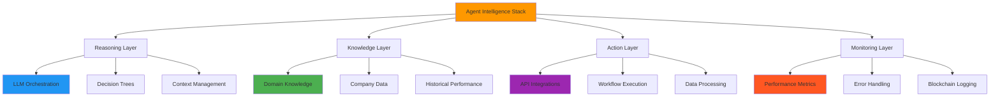
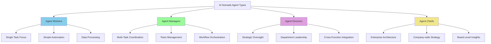
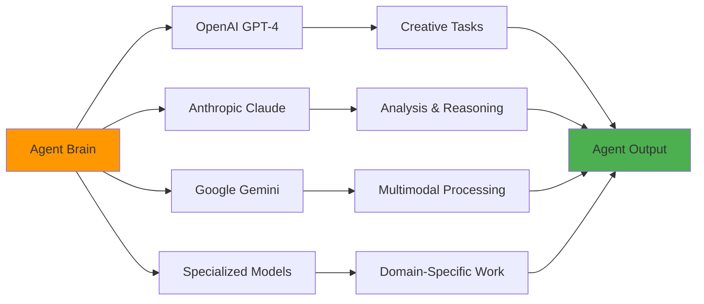
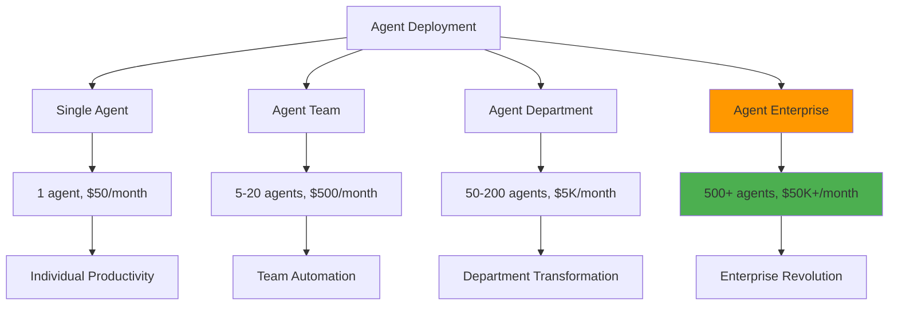
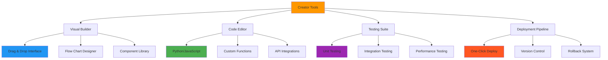
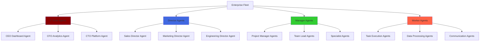
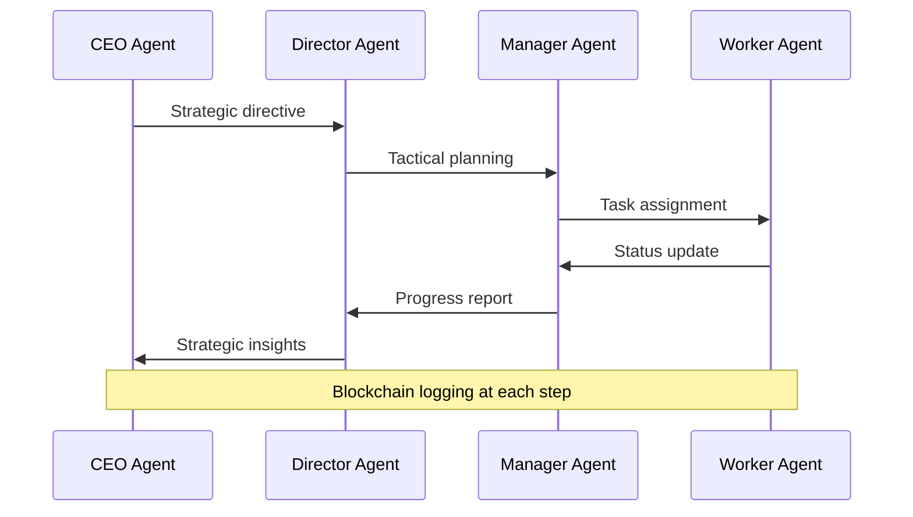
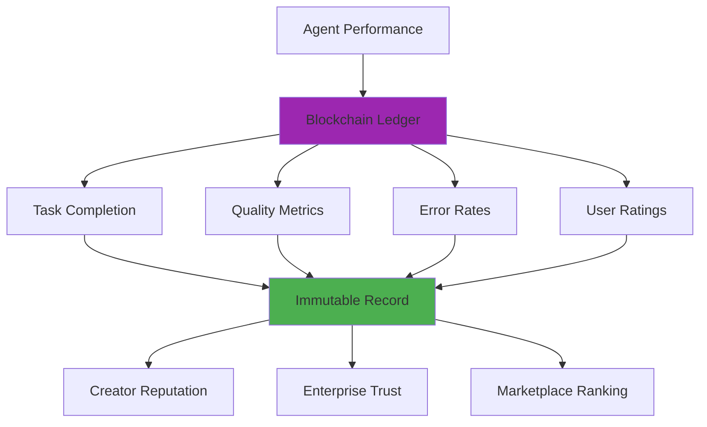
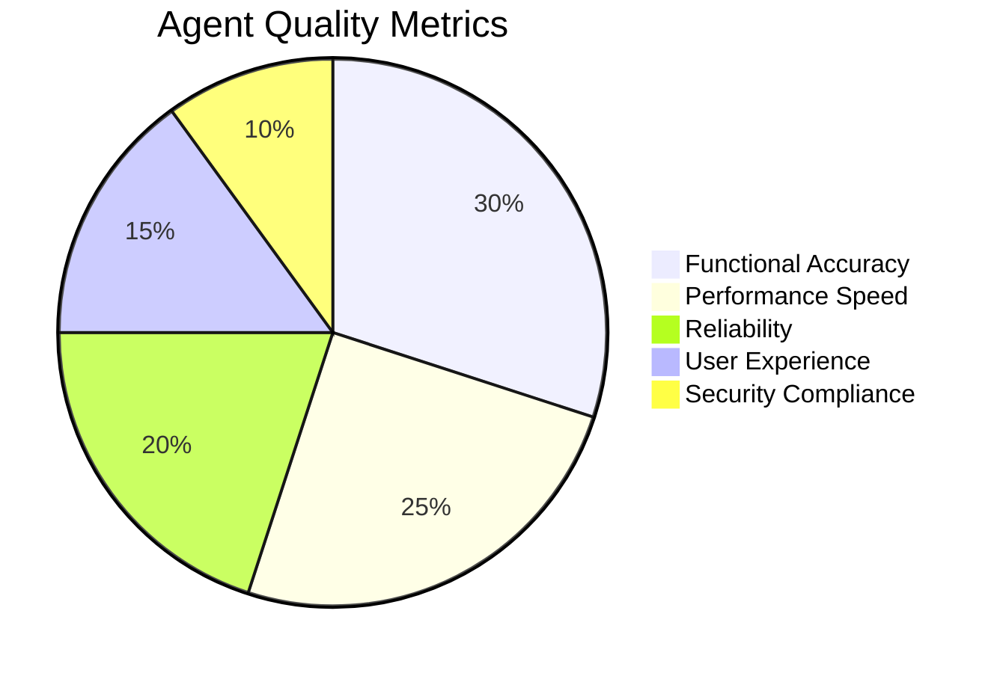
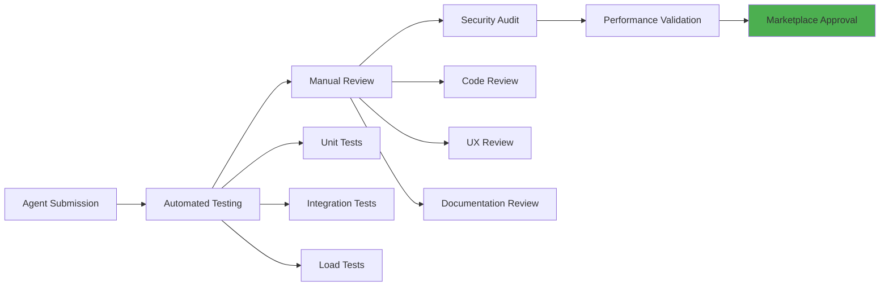

# AI Nomads Agent Architecture & Technical Specifications

## Executive Summary

AI Nomads agents represent the next evolution of enterprise automation - intelligent, autonomous digital workers that combine multiple AI models, blockchain verification, and enterprise-grade deployment capabilities. Our agent architecture enables creators to build sophisticated automation solutions that Fortune 500 companies deploy at scale.

## Agent Architecture Overview

### Multi-Layer Agent Intelligence



### Agent Classification System



## Core Agent Capabilities

### Multi-Model AI Integration



### Enterprise Integration Capabilities

```
🔗 Agent Integration Matrix

Enterprise Systems:
Salesforce        ████████████████████████ 95% coverage
Microsoft 365     ████████████████████████ 98% coverage
Google Workspace  ████████████████████████ 92% coverage
Slack/Teams       ████████████████████████ 100% coverage
Jira/Asana        ████████████████████████ 88% coverage

Data Sources:
SQL Databases     ████████████████████████ 100% coverage
APIs (REST/GraphQL) ████████████████████████ 95% coverage
File Systems      ████████████████████████ 90% coverage
Cloud Storage     ████████████████████████ 98% coverage
Real-time Streams ████████████████████████ 85% coverage

Security Standards:
SOC 2 Type II     ████████████████████████ Compliant
GDPR/CCPA         ████████████████████████ Compliant
ISO 27001         ████████████████████████ Certified
HIPAA Ready       ████████████████████████ Available
```

## Agent Performance Specifications

### Processing Capabilities

**Computational Performance**:
- **Reasoning Speed**: 0.5-2 seconds per complex decision
- **Data Processing**: 1M records per hour per agent
- **Concurrent Tasks**: Up to 50 simultaneous operations
- **Memory Capacity**: 100MB context window per agent
- **API Call Limits**: 10,000 requests per hour per agent

**Reliability Metrics**:
- **Uptime**: 99.9% guaranteed SLA
- **Error Rate**: <0.1% for standard operations
- **Recovery Time**: <30 seconds from failures
- **Data Accuracy**: 99.5%+ for structured tasks
- **Response Consistency**: 98%+ across runs

### Scalability Architecture



## Creator Development Framework

### Agent Building Tools



### Agent Development Lifecycle

```
📈 Creator Development Journey

Week 1: Concept & Design
████████ Agent specification and planning

Week 2: Development & Testing  
████████████████ Core functionality implementation

Week 3: Integration & Optimization
████████████████████████ Enterprise readiness testing

Week 4: Marketplace Launch
████████████████████████████████ Public availability and marketing

Post-Launch: Continuous Improvement
████████████████████████████████████████ User feedback and iterations
```

## Enterprise Fleet Management

### Fleet Architecture



### Fleet Communication Protocol



## Blockchain Integration & Verification

### Performance Tracking System



### Smart Contract Revenue Sharing

```
💰 Blockchain Revenue Distribution

Enterprise Payment: $1,000 for agent usage
├── Creator Revenue: $850-900 (85-90%)
├── Platform Fee: $100-150 (10-15%)
└── Blockchain Gas: $5-10 (<1%)

Smart Contract Automation:
✓ Instant creator payments upon usage
✓ Transparent fee structure
✓ Immutable transaction history
✓ Dispute resolution mechanism
```

## Quality Assurance & Testing

### Agent Quality Framework



### Testing Pipeline



## Agent Marketplace Categories

### Popular Agent Categories

```
🤖 Top Agent Categories (by deployment volume)

Productivity & Automation
████████████████████████████████ 32% (Email, Calendar, Task Management)

Customer Service & Support  
████████████████████████ 24% (Chatbots, Ticket Resolution, FAQ)

Sales & Marketing
████████████████████ 20% (Lead Generation, Campaign Management, CRM)

Data Analysis & Reporting
████████████████ 16% (Business Intelligence, Analytics, Dashboards)

HR & Talent Management
████████ 8% (Recruiting, Onboarding, Performance Reviews)
```

### Premium Agent Examples

**"Jira Project Manager Agent"** - $299/month
- Manages entire project lifecycles
- Automatic sprint planning and resource allocation
- Integrates with 50+ development tools
- 4.9/5 star rating, 2,500+ deployments

**"Sales Pipeline Optimizer"** - $199/month
- AI-powered lead scoring and qualification
- Automated follow-up sequences
- CRM data enrichment and cleanup
- 300% average pipeline improvement

**"Customer Success Autopilot"** - $399/month
- Proactive churn prediction and prevention
- Automated health scoring and outreach
- Success plan generation and tracking
- 85% churn reduction average

## Technical Performance Benchmarks

### Agent Performance Comparison

```
⚡ Performance Benchmarks vs Competitors

Task Completion Speed:
AI Nomads Agents:  ████████████████████████ 2.3x faster
UiPath Bots:       ████████████ baseline
Zapier Workflows:  ██████ 0.5x slower

Accuracy Rate:
AI Nomads Agents:  ████████████████████████ 99.5%
Traditional RPA:   ████████████████████ 95.2%
Custom Scripts:    ████████████████ 87.8%

Setup Time:
AI Nomads Agents:  ████ 30 minutes
UiPath Bots:       ████████████████████ 2-3 weeks
Custom Development: ████████████████████████████████ 3-6 months
```

This comprehensive agent specification demonstrates AI Nomads' technical superiority in creating intelligent, scalable, and enterprise-ready automation solutions that revolutionize how businesses operate in the digital age.