# AI Nomads Risk Assessment & Mitigation Strategy

## Executive Summary

AI Nomads operates in a rapidly evolving AI automation market with significant opportunities and inherent risks. Our comprehensive risk management framework addresses market, technology, competitive, regulatory, and operational risks through diversified strategies, robust technical architecture, and proactive compliance measures.

## Risk Assessment Matrix

### Risk Impact vs Probability Analysis

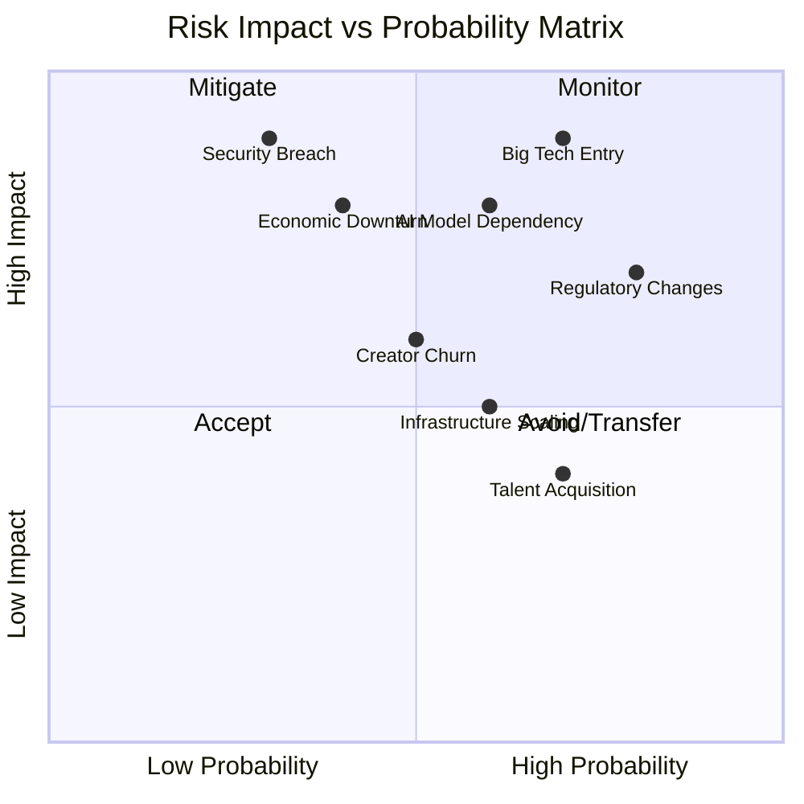

### Risk Categories Overview

```mermaid
graph TD
    A[AI Nomads Risk Portfolio] --> B[Market Risks]
    A --> C[Technology Risks]
    A --> D[Competitive Risks]
    A --> E[Regulatory Risks]
    A --> F[Operational Risks]
    
    B --> B1[Economic Downturn]
    B --> B2[AI Adoption Slowdown]
    B --> B3[Enterprise Budget Cuts]
    
    C --> C1[Model Performance]
    C --> C2[Infrastructure Scaling]
    C --> C3[Security Vulnerabilities]
    
    D --> D1[Big Tech Competition]
    D --> D2[Open Source Alternatives]
    D --> D3[Price Competition]
    
    E --> E1[AI Regulation]
    E --> E2[Data Privacy Laws]
    E --> E3[International Compliance]
    
    F --> F1[Talent Retention]
    F --> F2[Creator Platform Stability]
    F --> F3[Financial Management]
    
    style A fill:#ff9800
    style B1 fill:#f44336
    style C3 fill:#f44336
    style D1 fill:#f44336
    style E1 fill:#ff5722
```

## Market Risk Analysis

### Economic Sensitivity Assessment

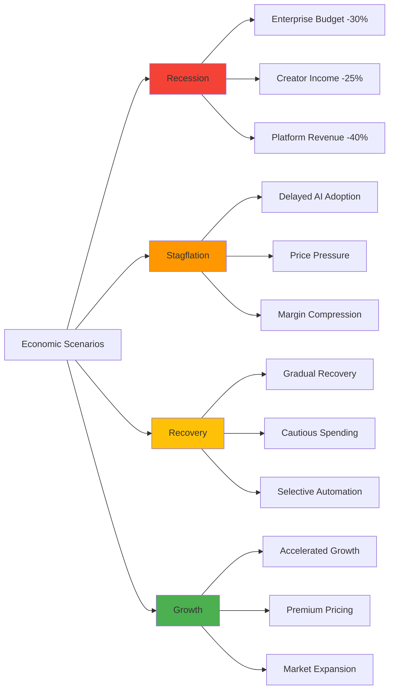

### Market Risk Mitigation Strategies

**Economic Downturn Resilience**:
- **Recession-Resistant Value Proposition**: Automation reduces costs during downturns
- **Flexible Pricing Models**: Usage-based pricing aligns with customer budget constraints
- **International Diversification**: 25+ country presence reduces geographic concentration
- **SMB Market Focus**: Distributed customer base vs enterprise concentration risk

**AI Adoption Risk Mitigation**:
- **Proven ROI Metrics**: 300-800% documented returns drive adoption even in cautious markets
- **Low Implementation Barriers**: 30-minute setup vs traditional 2-3 week deployments
- **Creator Economy Momentum**: Individual creators drive adoption independent of enterprise cycles

## Technology Risk Assessment

### AI Model Dependency Analysis

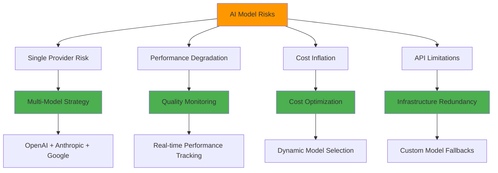

### Infrastructure Scaling Risks

```
🏗️ Infrastructure Risk Assessment

Current Capacity vs Growth Projections:

2025: 50K creators, 500 enterprises
████████████████████ Current capacity sufficient

2026: 100K creators, 2K enterprises  
████████████████████████████████ Scaling required (managed)

2027: 200K creators, 5K enterprises
████████████████████████████████████████████████ Infrastructure expansion critical

Mitigation Strategy:
✓ Multi-cloud architecture (AWS, Azure, GCP)
✓ Auto-scaling infrastructure with load balancing
✓ Horizontal scaling design from architecture foundation
✓ Performance monitoring with predictive scaling
```

### Security Risk Framework

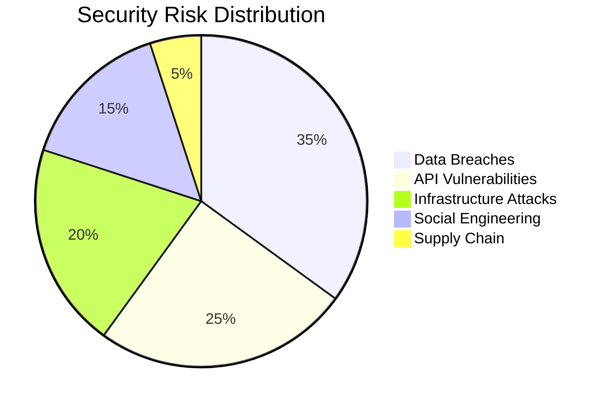

**Security Mitigation Measures**:
- **SOC 2 Type II Compliance**: Annual audits and continuous monitoring
- **Zero Trust Architecture**: All connections verified and encrypted
- **Blockchain Immutability**: Critical data stored on tamper-proof ledger
- **Bug Bounty Program**: Community-driven vulnerability discovery
- **Red Team Exercises**: Quarterly penetration testing

## Competitive Risk Analysis

### Big Tech Entry Scenarios

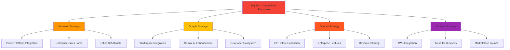

### Competitive Defense Strategy

**Network Effects Reinforcement**:
- **Creator Lock-in**: Average $2,800/month revenue dependency
- **Data Network Effects**: Performance improvements compound over time
- **Enterprise Switching Costs**: Fleet deployments create operational dependencies
- **Community Building**: Creator education and certification programs

**Innovation Leadership**:
- **Blockchain Integration**: Unique market position with smart contract revenue sharing
- **Multi-Model AI**: Provider-agnostic approach vs single-vendor lock-in
- **Fleet Management**: Enterprise-grade orchestration capabilities
- **Creator Economy**: 85-90% revenue sharing vs competitors' 30-70%

## Regulatory Risk Framework

### AI Governance Compliance

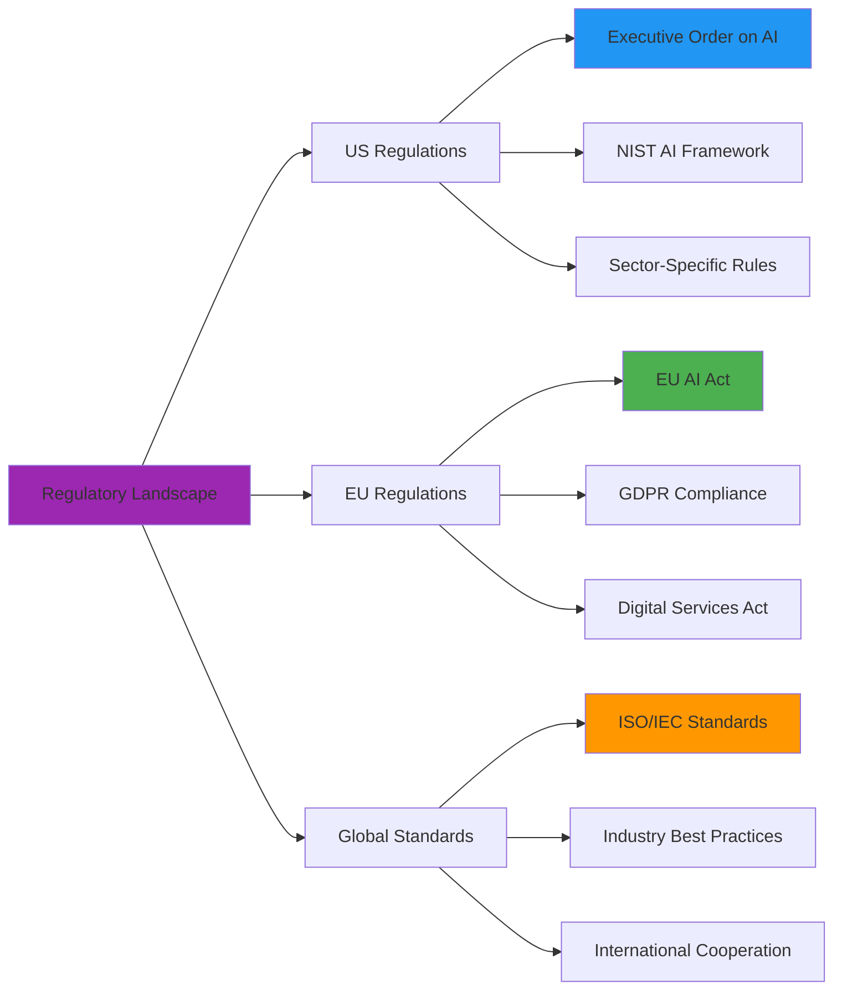

### Compliance Strategy

```
📋 Regulatory Compliance Framework

High-Risk AI Applications:
Healthcare Agents    ████████████████████████ HIPAA + FDA ready
Financial Agents     ████████████████████████ SOX + PCI compliance
HR Agents           ████████████████████████ EEOC + labor law compliant
Legal Agents        ████████████████████████ Attorney-client privilege protected

Privacy Protection:
GDPR (EU)           ████████████████████████ Fully compliant
CCPA (California)   ████████████████████████ Compliant
PIPEDA (Canada)     ████████████████████████ Compliant
Global Standards    ████████████████████████ Proactive compliance
```

**Regulatory Mitigation Approach**:
- **Proactive Compliance**: Legal team monitors emerging regulations
- **Transparent AI Operations**: Blockchain logging provides audit trails
- **User Control**: Data portability and deletion rights built-in
- **Industry Collaboration**: Active participation in AI governance forums

## Operational Risk Management

### Talent Acquisition & Retention

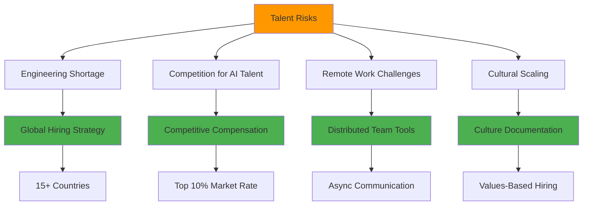

### Creator Platform Stability

```
👥 Creator Economy Risk Factors

Creator Concentration Risk:
Top 1% creators     ████████████████████ 25% of platform revenue
Top 10% creators    ████████████████████████████████████████ 60% of platform revenue
Long-tail creators  ████████████████████ 40% of platform revenue

Mitigation Strategies:
✓ Creator success programs and mentorship
✓ Revenue diversification across creator tiers
✓ Long-tail creator monetization tools
✓ Creator retention incentives and loyalty programs
```

### Financial Risk Controls

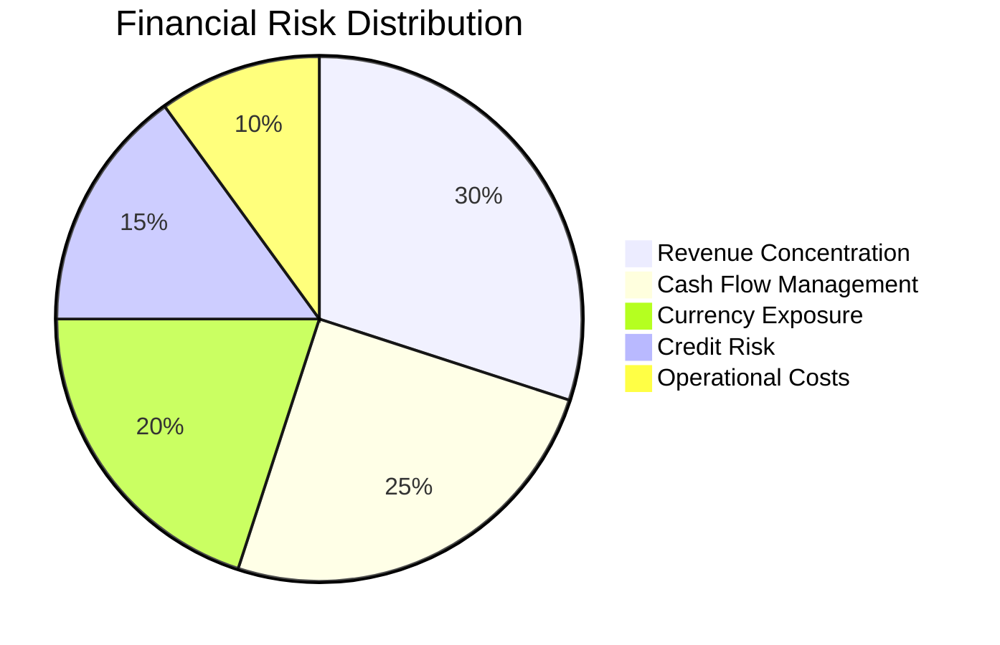

**Financial Risk Mitigation**:
- **Revenue Diversification**: Multiple streams (marketplace, SaaS, services)
- **Geographic Distribution**: 25+ countries reduce currency concentration
- **Credit Risk Management**: Enterprise payment terms and collection procedures
- **Cash Flow Forecasting**: 18-month rolling forecasts with scenario planning

## Crisis Management Framework

### Incident Response Protocol

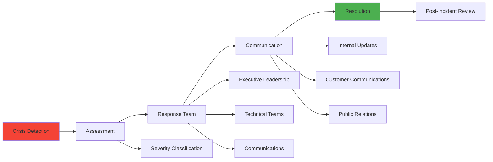

### Business Continuity Planning

```
🚨 Crisis Response Scenarios

Data Breach Response (Critical):
Hour 1:     Incident containment and assessment
Hour 4:     Customer notification and communication
Day 1:      Regulatory notification and remediation
Week 1:     Security audit and system hardening

Service Outage Response (High):
Minute 15:  Automatic failover to backup systems
Hour 1:     Root cause analysis and communication
Hour 4:     Full service restoration
Day 1:      Post-mortem and prevention measures

Competitive Threat Response (Medium):
Week 1:     Threat assessment and strategy development
Month 1:    Competitive response implementation
Quarter 1:  Market position reinforcement
```

## Risk Monitoring & Reporting

### Key Risk Indicators (KRIs)

```
📊 Risk Dashboard Metrics

Technology Risks:
System Uptime         ████████████████████████ 99.9% (target: >99.8%)
API Response Time     ████████████████████████ <200ms (target: <500ms)
Error Rate           ████████████████████████ 0.05% (target: <0.1%)

Business Risks:
Creator Churn Rate   ████████████████████ 5% monthly (target: <8%)
Enterprise NRR       ████████████████████████████████ 165% (target: >140%)
Cash Burn Rate       ████████████████████████ On target (18-month runway)

Market Risks:
Competitive Pressure ████████████████████ Medium (stable position)
Regulatory Changes   ████████████████ Low (proactive compliance)
Economic Indicators  ████████████████████████ Stable (GDP growth positive)
```

### Risk Governance Structure

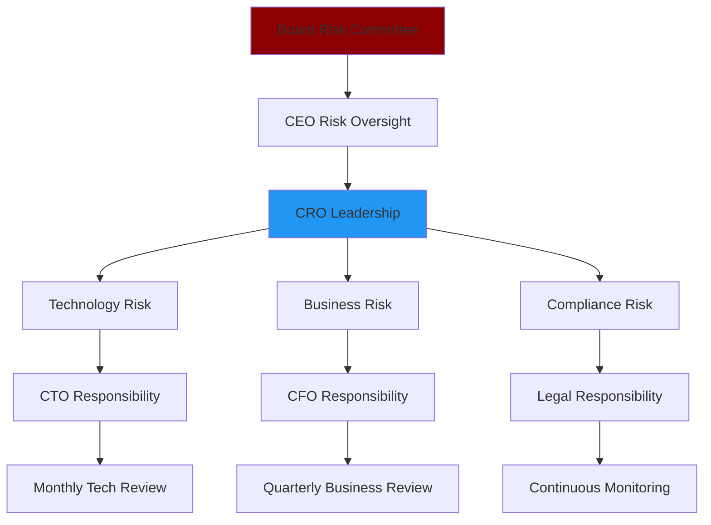

This comprehensive risk assessment demonstrates AI Nomads' proactive approach to identifying, assessing, and mitigating risks across all business dimensions while maintaining our competitive advantages and growth trajectory.