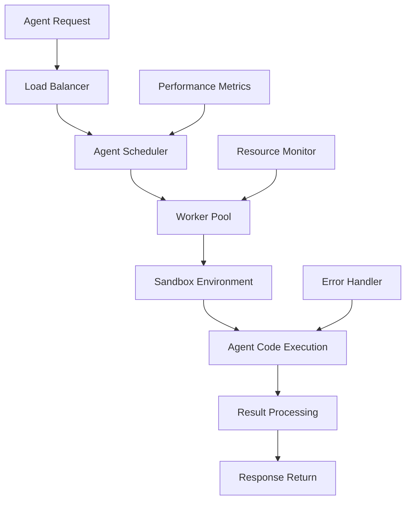
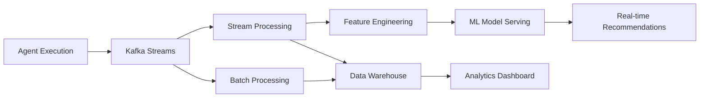
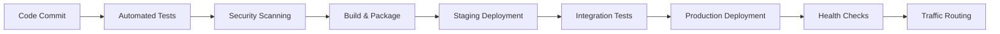

# AI Nomads Technical Architecture

## System Overview

AI Nomads operates as a distributed platform combining enterprise-grade infrastructure with creator-friendly interfaces. Our architecture enables millions of AI agents to operate simultaneously while maintaining sub-second response times and 99.99% uptime.

## Core Architecture Principles

### Microservices Foundation
- Domain-driven service boundaries
- Event-driven communication patterns
- Independent deployment capabilities
- Fault isolation and resilience
- Horizontal scaling architecture

### Data-First Design
- Medallion architecture (Bronze, Silver, Gold layers)
- Real-time streaming with Apache Kafka
- ACID compliance with Delta Lake
- Automated data quality monitoring
- ML-ready feature engineering pipelines

### Security by Design
- Zero-trust network architecture
- End-to-end encryption for all communications
- Role-based access control (RBAC)
- Automated threat detection and response
- Compliance-first development practices

## Technology Stack

### Frontend Layer
```
React 18 + TypeScript + Vite
├── UI Framework: shadcn/ui + Radix UI primitives
├── Styling: TailwindCSS with custom design system
├── 3D Graphics: Three.js with WebGL optimization
├── State Management: TanStack Query + Zustand
├── Routing: Wouter for client-side navigation
├── Charts: Recharts + D3.js for data visualization
└── Mobile: Progressive Web App (PWA) capabilities
```

### Backend Services
```
Node.js + Express + TypeScript
├── API Gateway: Express with middleware architecture
├── Authentication: JWT + Passport.js + OAuth 2.0
├── Database: PostgreSQL with Drizzle ORM
├── Caching: Redis with clustering support
├── Message Queue: Apache Kafka with Schema Registry
├── File Storage: AWS S3 with CDN distribution
└── Background Jobs: Bull Queue with Redis backend
```

### AI Agent Runtime
```
Agent Execution Engine
├── Runtime: Node.js workers with sandboxing
├── Model Integration: OpenAI, Anthropic, Cohere APIs
├── Memory Management: Vector databases (Pinecone)
├── Tool Integration: RESTful APIs and webhooks
├── Performance Monitoring: Custom metrics collection
└── Error Handling: Automatic retry and fallback
```

### Blockchain Infrastructure
```
Thirdweb SDK Integration
├── Smart Contracts: Solidity on Ethereum/Polygon
├── Payment Processing: Multi-chain support
├── Revenue Sharing: Automated distribution
├── Reputation System: On-chain performance tracking
├── Governance: DAO mechanisms for platform decisions
└── Interoperability: Cross-chain asset transfers
```

### Data Platform
```
Modern Data Stack
├── Ingestion: Apache Kafka + Kafka Connect
├── Processing: Apache Spark on Kubernetes
├── Storage: Delta Lake with ACID transactions
├── Warehouse: Snowflake for analytics workloads
├── Feature Store: Feast for ML feature management
├── Orchestration: Apache Airflow with Kubernetes
└── Monitoring: Great Expectations + custom validators
```

### Infrastructure Layer
```
Cloud-Native Deployment
├── Container Runtime: Docker with Alpine Linux
├── Orchestration: Kubernetes with Helm charts
├── Service Mesh: Istio for traffic management
├── Monitoring: Prometheus + Grafana + Jaeger
├── Logging: ELK Stack (Elasticsearch, Logstash, Kibana)
├── CI/CD: GitHub Actions with automated testing
└── Infrastructure as Code: Terraform + Ansible
```

## Scalability Architecture

### Horizontal Scaling Strategy
- **API Gateway**: Load balancer with auto-scaling groups
- **Application Servers**: Kubernetes pods with HPA
- **Database**: Read replicas with connection pooling
- **Cache Layer**: Redis Cluster with automatic failover
- **Message Queues**: Kafka partitioning and replication

### Performance Optimization
- **CDN Distribution**: Global edge caching with CloudFlare
- **Database Optimization**: Query optimization and indexing
- **Caching Strategy**: Multi-layer caching (browser, CDN, application, database)
- **Connection Management**: Connection pooling and keepalive
- **Compression**: Gzip and Brotli compression for all responses

### Geographic Distribution
- **Multi-Region Deployment**: US, Europe, Asia-Pacific data centers
- **Data Residency**: Regional data storage for compliance
- **Edge Computing**: Agent execution at edge locations
- **Latency Optimization**: Regional API endpoints and caching

## Security Architecture

### Network Security
- **Zero-Trust Model**: No implicit trust, verify everything
- **Network Segmentation**: Isolated subnets for different services
- **WAF Protection**: Web Application Firewall with DDoS protection
- **VPN Access**: Secure remote access for development teams
- **Certificate Management**: Automated SSL/TLS certificate rotation

### Application Security
- **Input Validation**: Comprehensive sanitization and validation
- **SQL Injection Prevention**: Parameterized queries and ORM usage
- **XSS Protection**: Content Security Policy and output encoding
- **CSRF Protection**: Token-based request validation
- **Rate Limiting**: API throttling and abuse prevention

### Data Security
- **Encryption at Rest**: AES-256 encryption for all stored data
- **Encryption in Transit**: TLS 1.3 for all communications
- **Key Management**: AWS KMS with automatic rotation
- **Data Masking**: PII protection in non-production environments
- **Access Logging**: Comprehensive audit trails for all data access

### Compliance Framework
- **GDPR Compliance**: Data portability, right to erasure, consent management
- **SOC 2 Type II**: Security, availability, processing integrity
- **ISO 27001**: Information security management system
- **CCPA Compliance**: California consumer privacy protection
- **HIPAA Ready**: Healthcare data handling capabilities

## Agent Execution Architecture

### Sandboxed Runtime Environment


### Resource Management
- **CPU Allocation**: Dynamic resource allocation based on agent complexity
- **Memory Limits**: Controlled memory usage with garbage collection
- **Execution Timeouts**: Configurable timeouts to prevent runaway processes
- **Concurrent Execution**: Parallel agent execution with resource pooling
- **Auto-scaling**: Automatic worker scaling based on demand

### Agent Communication
- **Inter-Agent Messaging**: Pub/sub patterns for agent collaboration
- **State Management**: Persistent state storage with versioning
- **Tool Integration**: Standardized APIs for external tool access
- **Event Streaming**: Real-time event processing and notifications
- **Result Caching**: Intelligent caching of agent outputs

## Data Flow Architecture

### Real-Time Data Pipeline


### Data Governance
- **Schema Evolution**: Backward-compatible schema changes
- **Data Lineage**: Complete tracking from source to consumption
- **Quality Monitoring**: Automated data quality checks and alerts
- **Access Control**: Fine-grained permissions and audit logging
- **Retention Policies**: Automated data lifecycle management

## Disaster Recovery & Business Continuity

### Backup Strategy
- **Database Backups**: Continuous backup with point-in-time recovery
- **Application State**: Kubernetes persistent volume snapshots
- **Configuration Backup**: Infrastructure as Code version control
- **Cross-Region Replication**: Automated data replication across regions

### Failover Mechanisms
- **Database Failover**: Automatic primary-replica promotion
- **Application Failover**: Kubernetes pod restart and rescheduling
- **Load Balancer Failover**: Health check-based traffic routing
- **DNS Failover**: Automatic DNS updates for service discovery

### Recovery Time Objectives
- **RTO (Recovery Time Objective)**: 15 minutes for critical services
- **RPO (Recovery Point Objective)**: 5 minutes maximum data loss
- **Service Availability**: 99.99% uptime SLA
- **Regional Failover**: Complete region failover within 30 minutes

## Monitoring & Observability

### Application Performance Monitoring
- **Distributed Tracing**: Request tracing across microservices
- **Metrics Collection**: Custom business and technical metrics
- **Log Aggregation**: Centralized logging with search capabilities
- **Alerting**: Intelligent alerting with escalation policies
- **Dashboard**: Real-time operational dashboards

### Business Intelligence
- **Revenue Tracking**: Real-time revenue and transaction monitoring
- **User Analytics**: Creator and enterprise usage patterns
- **Performance Analytics**: Agent performance and optimization insights
- **Market Intelligence**: Competitive analysis and market trends

## Development & Deployment

### CI/CD Pipeline


### Testing Strategy
- **Unit Testing**: 90%+ code coverage requirement
- **Integration Testing**: API and service integration validation
- **End-to-End Testing**: Complete user journey automation
- **Performance Testing**: Load testing and stress testing
- **Security Testing**: Automated vulnerability scanning

### Release Management
- **Blue-Green Deployment**: Zero-downtime deployments
- **Feature Flags**: Gradual feature rollout and A/B testing
- **Rollback Capability**: Instant rollback on deployment issues
- **Canary Releases**: Gradual traffic shifting for new releases

## Future Architecture Considerations

### Emerging Technologies
- **Quantum Computing**: Integration for complex optimization problems
- **Edge AI**: Distributed AI model serving at edge locations
- **5G Networks**: Ultra-low latency communication capabilities
- **Serverless Computing**: Function-as-a-Service for agent execution

### Scalability Targets
- **10M+ Concurrent Agents**: Massive parallel execution capability
- **Global Deployment**: 50+ regions worldwide
- **Real-time Processing**: Sub-100ms response times globally
- **Petabyte Scale**: Petabyte-scale data processing and storage

## Conclusion

Our technical architecture provides the foundation for AI Nomads to scale from thousands to millions of users while maintaining enterprise-grade security, performance, and reliability. The modular design enables rapid feature development and deployment while ensuring system stability and data integrity.